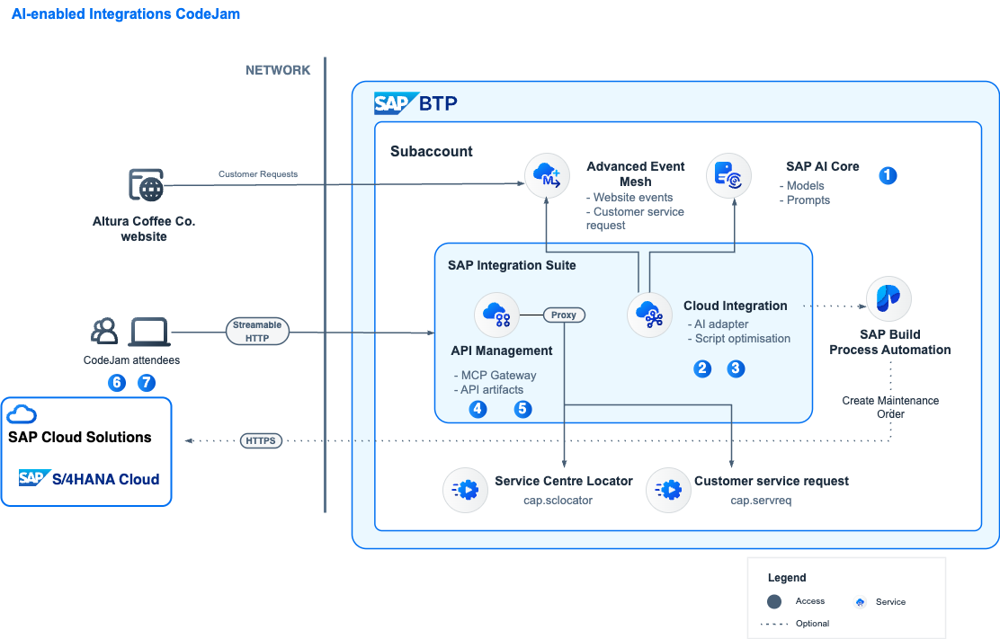

# AI-enabled Integrations with SAP Integration Suite

[](https://api.reuse.software/info/github.com/SAP-samples/ai-enabled-integrations-codejam)

---

¡Hola **${userDetails.firstName} ${userDetails.lastName}**! 👋

Welcome to the AI-enabled Integrations CodeJam. In this SAP CodeJam, we will look at [SAP Integration Suite](https://www.sap.com/products/technology-platform/integration-suite.html) and the different AI features that we can leverage to integrate our systems and help improve our integration development activities. We will receive customer request events from a customer website, process them in SAP Cloud Integration with the help of an LLM hosted in SAP AI Core. Then, that information will be sent to the Customer service request system. Once we complete the integration flow we will get familiar with the new MCP Gateway available in API Management. We will interact with an existing MCP server as we get familiar with the protocol. Then, we will create an MCP server for an existing API. To wrap things up, we will configure our MCP servers as tools available to an LLM and interact with them from a chat interface. By the end of the CodeJam, we will achieve a scenario like the one below in the diagram.

<!---->

[AI-enabled Integrations - End-to-end scenario](assets/diagrams/final-diagram.drawio ':include :type=code')


## Integration Scenario

Let's imagine we work for a company, Altura Coffee Co. Altura Coffee Co. sells high-end coffee machines for businesses, e.g. commercial espresso machines for cafes and restaurants, as well as industrial coffee machines perfect for large offices, designed to meet the coffee demands of a busy workforce. Altura Coffee Co. also provides maintenance and customer support for the coffee machines that they sell.

Currently, Altura Coffee Co. receives customer support requests via a form on their website. We oversee enabling the integration scenario that will process these requests, identify the closest service centre, and enabling an agent that can access this data.

## Requirements

To complete the exercises in this repository, you will need access to an SAP Integration Suite tenant with SAP AI Core configured. The exercises will guide you through setting up and using the different AI capabilities available in SAP Integration Suite. Please review the [prerequisites](prerequisites.md) before attending an event.

## Prerequisites

The prerequisites to follow the exercises in this repository, including hardware and software, are detailed in the [prerequisites](prerequisites.md) file.

### Live system

As part of this CodeJam we will provide you access to a live SAP Integration Suite instance with SAP AI Core already configured. Whenever you see the following emoji - 🔐 - in the exercises, it means that credentials will be provide to access/configure a live system.

<details>
<summary>⇟<i> What if a live system can't be provided as part of the CodeJam or you are going through the CodeJam content on your own?</i></summary>
<br/>

The participant will need to configure a live SAP Integration Suite system they have access to, along with an SAP AI Core instance. Also, the supporting apps will need to be deployed to SAP BTP. The applications contain README.md files with details on how to deploy them.

</details>

## Material organisation

The material consists of a series of exercises. These exercises build on each other and should be completed in the given order. For example, we start by getting familiar with the integration scenario and the tools we will be using, proceed to create and enhance our integration flow, and extend this in subsequent exercises to include MCP capabilities and an LLM client.

The repository includes some [slides](slides.md), which will be used when running an SAP CodeJam event. The slides were built using [Marp](https://github.com/marp-team/marp/) and an HTML export is included [here](slides.html). You can also [preview the slides here](https://htmlpreview.github.io/?https://github.com/SAP-samples/ai-enabled-integrations-codejam/blob/main/slides.html).

## Exercises

During the CodeJam you will complete each exercise one at a time. At the end of each exercise, questions are included to help you think about the content just covered and are to be discussed with the entire CodeJam class, led by the instructor, when everyone has finished that exercise.

If you finish an exercise early, please resist the temptation to continue with the next one. Instead, explore what you've just done and see if you can learn more about the subject covered. That way, we all stay on track together and can benefit from some reflection via the questions (and answers).

See below for an overview of the exercises part of this CodeJam.

- Please ensure that you have completed all the [prerequisites](prerequisites.md).
- Exercises:
  - [Exercise 00 - Get familiar with Altura Coffee Co. website](./exercises/00-get-familiar-altura-coffee-website/README.md)
  - [Exercise 01 - SAP AI Core and Prompt Template](./exercises/01-sap-ai-core-prompt-template/README.md)
  - [Exercise 02 - Generate an iFlow](./exercises/02-generate-iflow/README.md)
  - [Exercise 03 - Optimise script in iFlow](./exercises/03-optimise-script-iflow/README.md)
  - [Exercise 04 - Customer Service system API as MCP server](./exercises/04-customer-service-api-mcp-server/README.md)
  - [Exercise 05 - Expose existing API via MCP Gateway](./exercises/05-expose-api-mcp-gateway/README.md)
  - [Exercise 06 - Configure LLM client and MCP tools](./exercises/06-configure-llm-client-mcp-tools/README.md)
  - [Exercise 07 - Test the scenario](./exercises/07-test-scenario/README.md)

### Troubleshooting

While going through the exercises, you might encounter common problems not explicitly related to them. Check out the [troubleshooting.md](troubleshooting.md) page, which includes a list of these common problems and their potential solutions.

## Known Issues

None

## Feedback

If you can spare a couple of minutes at the end of the session, please help us improve for next time by giving me some feedback.

Simply use this [Give Feedback](https://github.com/SAP-samples/ai-enabled-integrations-codejam/issues/new?assignees=&labels=feedback&template=session-feedback-template.md&title=Feedback) link to create a special "feedback" issue, and follow the instructions there.

Gracias/Thank you/Obrigado/Merçi/Danke!

## Rendering the exercises with Docsify

The exercises in this repository can be rendered as a website using [Docsify](https://docsify.js.org/). Docsify serves the Markdown files directly in the browser, adding navigation, search, syntax highlighting and callout styling — no build step required.

To run the site locally:

1. Make sure you have [Node.js](https://nodejs.org/) installed.
2. From the root of the repository, start a local server:

   ```bash
   npx serve .
   ```

3. Open the URL printed in the terminal (by default <http://localhost:3000>) in your browser.

The entry point is [index.html](index.html), the navigation is defined in [_sidebar.md](_sidebar.md), and supporting assets (styles, scripts, images) live under [_assets/](_assets/). When running locally, participant credentials are read from the mock file at [_assets/mock/get-participant-info.json](_assets/mock/get-participant-info.json).

## How to obtain support

Support for the content in this repository is available during CodeJam events, for which this content has been designed.

Alternatively, if you are completing this CodeJam on your own, outside of an event, you can [create an issue](https://github.com/SAP-samples/ai-enabled-integrations-codejam/issues/new) in this repository if you find a bug or have questions about it.

For additional support, [ask a question in SAP Community](https://community.sap.com/t5/forums/postpage/board-id/application-developmentforum-board).

## Contributing
If you wish to contribute code, offer fixes or improvements, please send a pull request. Due to legal reasons, contributors will be asked to accept a DCO when they create the first pull request to this project. This happens in an automated fashion during the submission process. SAP uses [the standard DCO text of the Linux Foundation](https://developercertificate.org/).

## License
Copyright 2026 SAP SE or an SAP affiliate company and ai-enabled-integrations contributors. Please see our [LICENSE](LICENSE) for copyright and license information. Detailed information including third-party components and their licensing/copyright information is available [via the REUSE tool](https://api.reuse.software/info/github.com/SAP-samples/ai-enabled-integrations-codejam).