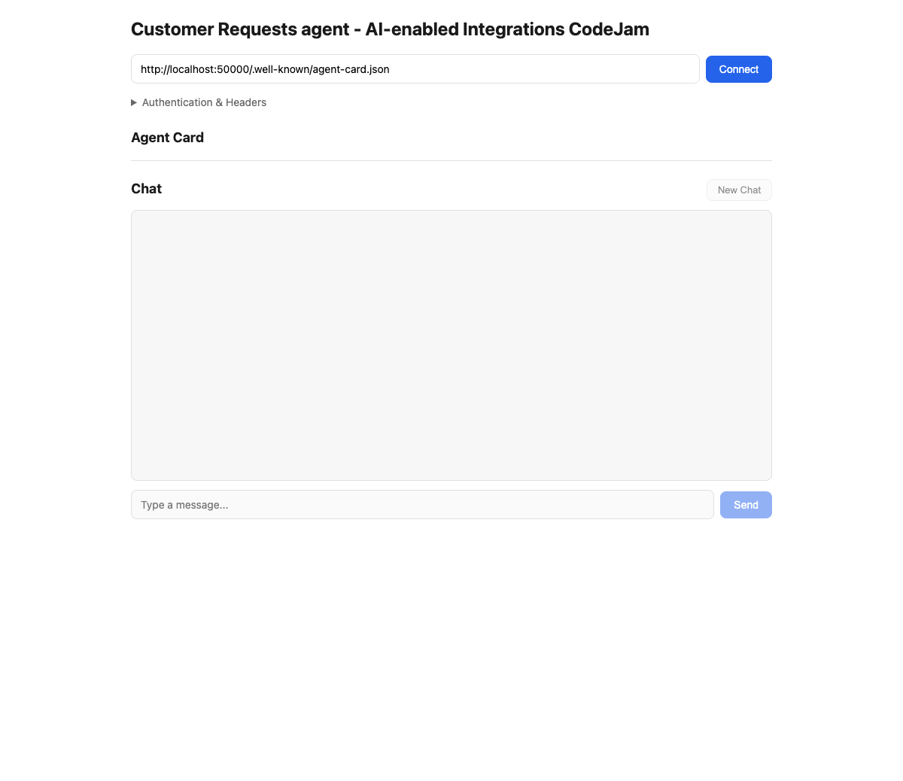

# Customer Request Agent

An AI agent that autonomously handles customer requests via MCP-exposed tools

## Overview

Uses A2A Protocol, LangGraph, LiteLLM, and SAP Cloud SDK.

## Structure

- `app/main.py` - A2A server entry
- `app/agent_executor.py` - Request handling
- `app/agent.py` - Agent logic

## Setup

### Virtual environment

```bash
cd app
python -m venv .venv
source .venv/bin/activate   # Windows: .venv\Scripts\activate
pip install -r ../requirements.txt
```

### Environment variables

Create `app/.env` (copy from `app/.env.example` if present) with:

| Variable | Description |
| --- | --- |
| `LITELLM_PROVIDER` | LLM provider (`sap` for SAP AI Core) |
| `AICORE_CLIENT_ID` | SAP AI Core service client ID |
| `AICORE_CLIENT_SECRET` | SAP AI Core service client secret |
| `AICORE_AUTH_URL` | OAuth token endpoint URL |
| `AICORE_BASE_URL` | SAP AI Core API base URL |
| `AICORE_RESOURCE_GROUP` | AI Core resource group |
| `IBD_TESTING` | Set to `1` to enable test mode |
| `INVOKE_LIVE_MCP` | Set to `1` to invoke live MCP tools |

Example `app/.env`:

```dotenv
LITELLM_PROVIDER="sap"

AICORE_CLIENT_ID=<your-client-id>
AICORE_CLIENT_SECRET=<your-client-secret>
AICORE_AUTH_URL=https://<subdomain>.authentication.<region>.hana.ondemand.com/oauth/token
AICORE_BASE_URL=https://api.ai.prod.<region>.aws.ml.hana.ondemand.com
AICORE_RESOURCE_GROUP="<your-resource-group>"

IBD_TESTING=1
INVOKE_LIVE_MCP=1
```

## Running

Start the agent server on port `50000`:

```bash
cd app
source .venv/bin/activate
python main.py --port 50000
```

Or via environment variables:

```bash
PORT=50000 python main.py
```

The server starts at `http://localhost:50000`. The A2A agent card is available at `http://localhost:50000/.well-known/agent-card.json`.

## Web UI

A very simple built-in chat UI, inspired by the A2A Inspector, is served at `http://localhost:50000/ui`. It lets you connect to the agent, inspect the agent card, and send messages directly in the browser.


