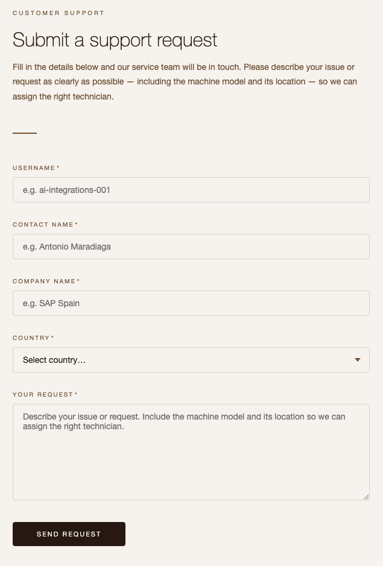

# Exercise 00 - Get familiar with Altura Coffee Co. website

Before we start building our integration scenario, it is important to get familiar with the systems and websites we will be interacting with during the CodeJam. In this exercise, we will explore two auxiliary applications: the Altura Coffee Co. company website, through which customers submit support requests, and the customer service system where processed requests will eventually appear.

At the end of this exercise, you'll have an understanding of how a customer submits a support request, what data is captured in the form, and what the target customer service system looks like.

> [!IMPORTANT]  <br/>System details and credentials required to complete this exercise 🔐 <br/><br/>
>
> | System | URL |
> | ---- | ---- |
> | Altura Coffee Co. website | ${credentialsObj.alturawebsite.url} |
> | Altura Customer Support Service | ${credentialsObj.alturacs.url} |

## The Altura Coffee Co. website

Altura Coffee Co. sells high-end coffee machines for businesses. Customers who experience issues with their equipment, or who need supplies, submit requests via a form on the company website.

👉 Navigate to the Altura Coffee Co. website - <dynamic>${credentialsObj.alturawebsite.url}</dynamic>

Take a moment to explore the website. Notice that there is a **Request Support** button on the top right corner. This will take you to the *Submit a support request form*, which is the form through which customers send their support requests.



> [!NOTE]
> The form is designed to capture free-text input, meaning the customer can describe their issue in their own words. This is exactly the kind of unstructured input that our integration scenario process by leveraging an LLM.

👉 Read through a sample support request to understand the kind of content the form captures. Below is an example of the type of message a customer might submit:

```text/plain
Hi customer support from Altura,

We have a La Marzocco Micra in the Plaza Pablo Picasso office in Madrid 28020, 
which is not extracting coffee as it should. Can you please send a technician to 
check the machine.

Also, we are running out of filters for the MoccaMaster that we have in the 
Castellana 85 office. Can you please send us a couple of boxes so that we have 
plenty of filters.

Thank you,
Antonio Maradiaga
```

Notice how the message includes:

- One or more pieces of **equipment** that need attention
- **Addresses** where the equipment is located
- A description of the **issue or request**
- A **contact name**

These are all pieces of data that our integration flow will need to extract and structure. This is why we will use an LLM in our iFlow - to make sense of unstructured text like this.

## The customer service system

Once a request has been processed by our integration flow, the structured data will be sent to a customer service system. This is where the support team will be able to see all incoming requests and act on them.

👉 Navigate to the [customer request service system](${credentialsObj.alturacs.url}). Choose one of the listed requests to familiarise yourself with a customer request.

At the moment, you might see some existing requests already in the system (submitted to demonstrate the expected end state). Take note of the data fields visible in each request - we will be populating these fields from our integration flow later in the CodeJam.

> [!TIP]
> 🧭 The customer service system exposes its data via a REST API. We will explore this API in detail in [Exercise 04](exercises/04-customer-service-api-mcp-server/README.md).

## Summary

Now that you are familiar with both the Altura Coffee Co. website and the customer service system, we have a clear picture of the integration scenario we are building. Customers will submit unstructured support requests through the website, our integration flow will process these requests using an LLM in SAP AI Core, and the resulting structured data will be posted to the customer service system.

## Further Study

* [SAP Integration Suite - Cloud Integration capability](https://help.sap.com/docs/integration-suite/sap-integration-suite/ci?locale=en-US)
* [SAP AI Core overview](https://help.sap.com/docs/sap-ai-core/sap-ai-core-service-guide/what-is-sap-ai-core)

---

If you finish earlier than your fellow participants, you might like to ponder these questions. There isn't always a single correct answer and there are no prizes - they're just to give you something else to think about.

1. Looking at the sample support request, what challenges would arise if we tried to extract the equipment and address information using a traditional rule-based approach (e.g. regular expressions)?
2. The customer service system uses a REST API to receive data. What are some alternative integration patterns that could be used to notify the team of a new request?
3. The sample request mentions two different pieces of equipment at two different addresses. How should our integration scenario handle multiple requests within a single message?

## Next

Continue to 👉 [Exercise 01 - SAP AI Core and Prompt Template](exercises/01-sap-ai-core-prompt-template/README.md)
