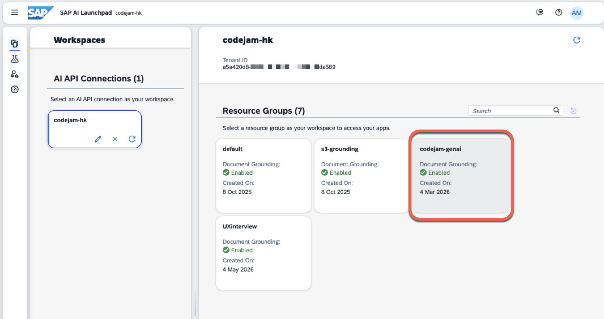
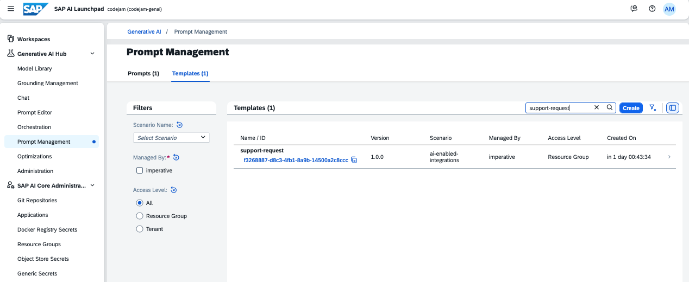
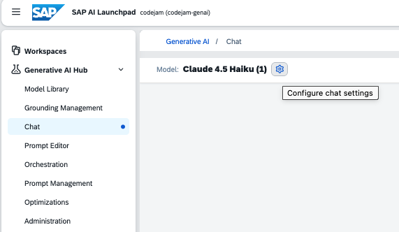
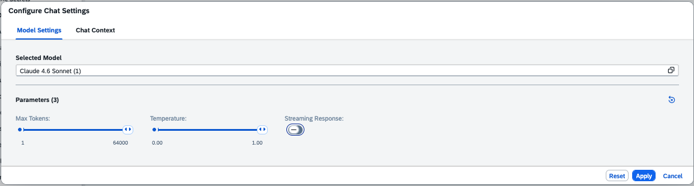
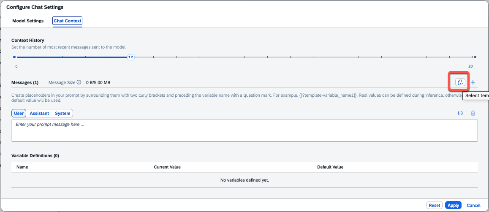

# Exercise 01 - SAP AI Core and Prompt Template

Before we proceed to create our integration flow, let's get familiar with SAP AI Core and the prompt template that will be at the heart of our integration scenario. Understanding what the prompt does, and how the LLM responds, will help us understand the data that will be flowing through our integration flow.

At the end of this exercise, you'll have an understanding of SAP AI Core, how prompt templates work, and how the LLM processes an unstructured customer support request to produce a structured JSON response.

> [!IMPORTANT]  <br/>Credentials required to complete this exercise 🔐 <br/><br/>
>
> | System | URL |
> | ---- | ---- |
> | SAP AI Launchpad | ${credentialsObj.aicore.url} |
>
> <br/>*If prompted to select an identity provider, always select* ***a7rg4vxjp.accounts.ondemand.com***.

## SAP AI Core and generative AI capabilities

[SAP AI Core](https://help.sap.com/docs/sap-ai-core) is a service on SAP BTP that provides infrastructure to train and serve AI models. As part of its generative AI capabilities, SAP AI Core includes the [Generative AI Hub](https://help.sap.com/docs/sap-ai-core/sap-ai-core-service-guide/generative-ai-hub-in-sap-ai-core), which gives you access to foundation models (LLMs) from multiple providers, such as OpenAI, Google, and Anthropic, through a unified interface.

The Generative AI Hub also allows you to create and manage **prompt templates** - reusable prompt structures that can be invoked consistently across different scenarios. This is particularly useful in integration contexts, where the same prompt logic needs to be applied to many different input messages.

## The prompt template

The prompt template used in this CodeJam instructs the LLM to act as a customer support assistant at Altura Coffee Co. Its job is to detect and classify any issues related to coffee machines mentioned in a customer message, extract address information, and assess the urgency of the request.

👉 Navigate to the [SAP AI Core - Generative AI Hub](${credentialsObj.aicore.url}) made available for this CodeJam. Select the workspace available, e.g. **codejam**, and the **codejam-genai** resource group.



👉 Expand the hamburger button on the top left and go to Generative AI Hub > Prompt Management and then select the Templates tab. Search for the `support-request` part of the `ai-enabled-integrations` scenario.



The prompt template instructs the model to:

1. Detect any issues related to coffee machines mentioned in the text
2. Extract all addresses mentioned (including the customer's sender address, if present)
3. Classify each address by its relevance to the request (from 1 to 10)
4. Summarise the overall request in a single sentence
5. Assess the urgency of the request (Low, Medium, or High)

The model is instructed to respond **only** with a JSON structure matching the following schema:

```json
{
  "tasks": [
    {
      "equipment": [
        "Namelmodel of coffee machine 1",
        "Name/model of coffee machine 2"
      ],
      "address": "extracted address here",
      "country": "extracted country here",
      "postal_code": "extracted postal code here",
      "relevance": 1
    },
    {
      "equipment": [
        "Namelmodel of coffee machine 1",
        "Namelmodel of coffee machine 2"
      ],
      "address": "extracted address here",
      "country": "extracted country here",
      "postal_code": "extracted postal code here",
      "relevance": 10
    }
  ],
  "relevance": 1,
  "request_original": "original unstructured customer support request here",
  "request_summary": "Summary of the request",
  "urgency": "Low/Medium/High"
}
```

## Test the prompt template

Now let's test the prompt template with a sample customer support request to verify the output.

👉 Navigate to the **Chat** in **Generative AI Hub**, select the **Settings** button. This will open the Configure Chat Settings



👉 In the Chat settings, select `Claude 4.6 Sonnet` as the model and untoggle the **Streaming Response** option. 



👉 Now, in the **Chat Context** tab, select the **Select Template** button and select the `support-request` prompt template. This will load the prompt instructions into the system prompt for the chat. Select the **Apply** button.



Now in the chat, enter a customer support request and send the message.:

```
Hi customer support from Altura,

We have a La Marzocco Micra in the Plaza Pablo Picasso office in Madrid 28020, 
which is not extracting coffee as it should. Can you please send a technician to 
check the machine.

Also, we are running out of filters for the MoccaMaster that we have in the 
Castellana 85 office. Can you please send us a couple of boxes so that we have 
plenty of filters.

Thank you,
${userDetails.firstName} ${userDetails.lastName}
```

Given that we've specified explicit instruction to the LLM, whatever message we send to it, it will reply in JSON format. You should receive a response similar to the following:

```json
{
  "tasks": [
    {
      "equipment": [
        "La Marzocco Micra"
      ],
      "address": "Plaza Pablo Picasso, Madrid",
      "country": "Spain",
      "postal_code": "28020",
      "relevance": 10
    },
    {
      "equipment": [
        "MoccaMaster"
      ],
      "address": "Castellana 85, Madrid",
      "country": "Spain",
      "postal_code": "Unknown",
      "relevance": 7
    }
  ],
  "relevance": 8,
  "request_original": "Hi customer support from Altura, We have a La Marzocco Micra in the Plaza Pablo Picasso office in Madrid 28020, which is not extracting coffee as it should. Can you please send a technician to check the machine. Also, we are running out of filters for the MoccaMaster that we have in the Castellana 85 office. Can you please send us a couple of boxes so that we have plenty of filters. Thank you, ${userDetails.firstName} ${userDetails.lastName}",
  "request_summary": "Customer ${userDetails.firstName} ${userDetails.lastName} reports two issues: (1) A La Marzocco Micra at Plaza Pablo Picasso, Madrid 28020 is not extracting coffee properly and requires a technician visit. (2) A MoccaMaster at Castellana 85, Madrid is running low on filters and the customer requests a supply of filter boxes.",
  "urgency": "Medium"
}
```

> [!IMPORTANT]
> Notice that the LLM extracted two separate address entries: one for each service request. This structured output is what our iFlow will receive from the AI adapter and pass on to downstream steps.

👉 Try submitting a few of your own test messages - for example, a request in a different language, or a message that mentions only one piece of equipment. Observe how the model adapts its response.

🧭 Take some time to explore the other models available in the Generative AI Hub. You might notice that different models respond slightly differently to the same prompt. In our iFlow, we will use the model that has been pre-configured for the CodeJam deployment.

## Summary

Now that you are familiar with SAP AI Core and the prompt template, we understand exactly what the LLM expects as input and what it will return. This structured JSON output is what our integration flow will rely on to route requests, identify service centres, and notify the support team.

In the next exercise, we will create the iFlow that puts all of this together.

## Further Study

* [SAP AI Core - Generative AI Hub](https://help.sap.com/docs/sap-ai-core/sap-ai-core-service-guide/generative-ai-hub-in-sap-ai-core)
* [Prompt engineering guide](https://help.sap.com/docs/sap-ai-core/sap-ai-core-service-guide/prompt-engineering)
* [Available models in SAP AI Core Generative AI Hub](https://help.sap.com/docs/sap-ai-core/sap-ai-core-service-guide/models-and-scenarios-in-generative-ai-hub)

---

If you finish earlier than your fellow participants, you might like to ponder these questions. There isn't always a single correct answer and there are no prizes - they're just to give you something else to think about.

1. The prompt template instructs the model to always return valid JSON. What could go wrong if the LLM returns malformed JSON, and how would you handle that in an integration flow?
2. The prompt uses a relevance score from 1 to 10 to classify addresses. Can you think of a scenario where the sender's address (relevance 1) would actually be the most useful address in the request?
3. We are using a single prompt template for all incoming requests. What are the trade-offs of using a single generic prompt vs. having different prompts for different types of requests (e.g. repair vs. supply requests)?
   <details>
    <summary>⇟ Hint 🔦</summary>
    <i>Think about flexibility vs. complexity. A single prompt simplifies maintenance but may produce less precise results. Multiple prompts can be more tailored but require a classification step to decide which prompt to use.</i>
   </details>

## Next

Continue to 👉 [Exercise 02 - Generate an iFlow](../02-generate-iflow/README.md)
