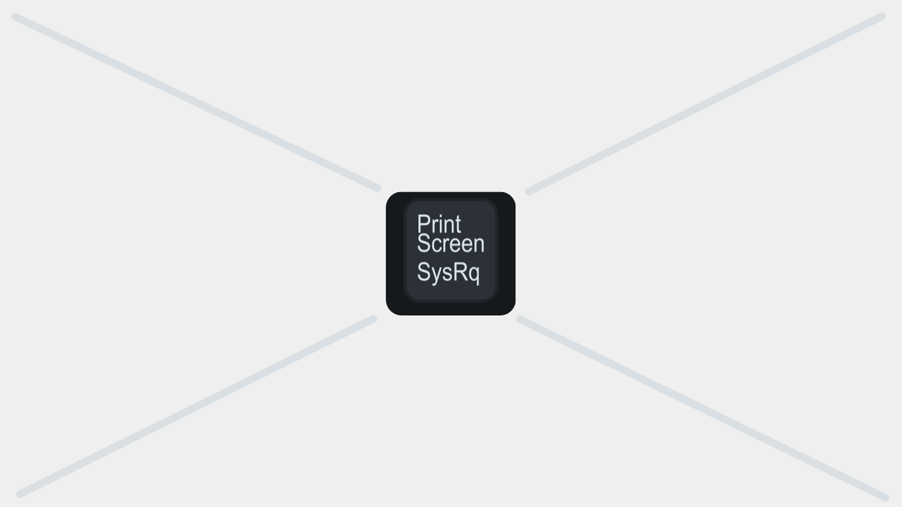

# Exercise 02 - Generate an iFlow

Now that we understand the integration scenario and what our prompt template produces, it is time to create the integration flow (iFlow) that will process incoming customer support requests. In this exercise, we will use the **Integration Flow Generation** feature in SAP Integration Suite to create an initial iFlow from a natural language description, and then refine it to fit our scenario.

At the end of this exercise, you'll have a deployed iFlow that receives a customer support request, leverages an LLM in SAP AI Core to extract the relevant information from the customer request input, and posts the structured response to the customer service system.

## Integration Flow Generation

SAP Integration Suite includes an AI-powered feature called **Generation of Integrations** that allows you to describe an integration scenario in natural language and have the system generate an initial iFlow for you. This can significantly speed up the initial setup, though you will typically need to adjust and configure the generated flow to match your specific requirements.

> [!NOTE]
> Integration Flow Generation uses embedded AI to interpret your description and translate it into an iFlow. The quality of the generated flow depends heavily on the clarity and specificity of your prompt. The more context you provide, the closer the initial result will be to what you need.

## Generate the iFlow

👉 Navigate to SAP Integration Suite and go to **Design > Integrations and APIs**. Now, create a new Integration Package, name it `AI enabled integrations - 000` and select the **Save** button. 


👉 Now, navigate to the **Artifacts** tab the package, select **Add** and **Integration Flow**. In the pop-up select the **Generate Integration** button.


👉 Use the prompt below to describe the integration flow we want to generate. Select the **Send** button.

```
Generate an iFlow that will connect to SAP Integration Suite, advanced event mesh to consume customer requests received in the altura/website/support/request/v1/submitted/ai-integrations-000 topic. The event published to the topic is a JSON payload will contain various fields: contact_name, contact_email, country and customer_request. Convert the JSON payload to XML and extract the value in the customer_request field (text input). The text input will then be sent to an LLM hosted in SAP AI Core. We can then use the AI adapter to communicate with the LLM. The LLM will return a JSON structure. This response will then be further processed by a Groovy script for a minor transformation. After the Groovy script, we will post the structured request data to a customer service system using an HTTP receiver adapter. The iFlow should include error handling.
```

Now Cloud Integration will process the prompt and give us the option to name the integration flow. Enter a name, e.g. `AEM_WebsiteCustomerRequest_AICore_Processor_000`. When ready, select the **Generate** button to create the iFlow.


> [!NOTE]
> By nature Generative AI is non-deterministic. Meaning that the iFlow generated may vary each time. The important thing at this stage is to get started with core flow structure. We can always adjust and refine the generated flow in the next steps.
> 
> 

👉 Review the generated iFlow. You should see something similar to the following steps:

1. AEM sender (receives incoming request)
2. AI adapter (calls the LLM in SAP AI Core)
3. Groovy script (transforms the response)
4. HTTP receiver (posts the structured request data to the customer service system)

## Configure the AEM sender adapter

> [!WARNING]
> It is possible that the generated iFlow may not include an AEM sender adapter and instead shows an AMQP connection. If this is the case, you will need to remove the existing connection and add one manually. To do this, drag the connection from AEM sender system to the Start message event node. In the pop-up dialog, select the **AdvancedEventMesh** adapter type.

The generated iFlow will be kicked of by the AEM adapter step, but it will need to be configured with the correct connection details for the AEM instance that has been provided for the CodeJam.

👉 Click on the AEM adapter step in the iFlow and open its configuration panel. Set the following properties:

| Property | Value |
|----------|-------|
| Connection | *Select the AI Core destination configured in your subaccount* 🔐 |
| Model | *As provided by your instructor* 🔐 |
| Prompt Template | *Select the prompt template created in Exercise 01* |

## Configure the AI adapter

The generated iFlow will include an AI adapter step, but it will need to be configured with the correct connection details for your SAP AI Core instance.



👉 Click on the AI adapter step in the iFlow and open its configuration panel. Set the following properties:

| Property | Value |
|----------|-------|
| Connection | *Select the AI Core destination configured in your subaccount* 🔐 |
| Model | *As provided by your instructor* 🔐 |
| Prompt Template | *Select the prompt template created in Exercise 01* |

> [!IMPORTANT]
> The AI adapter in SAP Cloud Integration connects to SAP AI Core using the credentials (security material) previously deployed in the tenant. Your instructor will confirm the credentials name. 🔐

## The Groovy script

Between the AI adapter response and the final HTTP call, the generated iFlow includes a Groovy script step. For now, this step can contain a minimal script that simply passes the payload through - we will enhance it in the next exercise.


👉 Open the Groovy script step and verify it does not break the payload. A minimal placeholder script looks like this:

```groovy
import com.sap.gateway.ip.core.customdev.util.Message

def Message processData(Message message) {
    return message
}
```

## Configure the HTTP receiver (Customer Service System)

The final step in the iFlow posts the structured request data to the customer service system.


👉 Click on the HTTP receiver step and configure it with the details below.

| Property | Value |
|----------|-------|
| Endpoint | *As provided by your instructor* 🔐 |
| Credentials | *Select the AI Core destination configured in your subaccount* 🔐 |

## Deploy and test the iFlow

👉 **Save** and **Deploy** the iFlow. Navigate to **Monitor > Integrations** to verify that the deployment was successful.


👉 Once deployed, navigate to Altura's Coffee website to send a customer request. Use the sample request from Exercise 00:

```text/plain
Hi customer support from Altura,

We have a La Marzocco Micra in the Plaza Pablo Picasso office in Madrid 28020, 
which is not extracting coffee as it should. Can you please send a technician to 
check the machine.

Also, we are running out of filters for the MoccaMaster that we have in the 
Castellana 85 office. Can you please send us a couple of boxes so that we have 
plenty of filters.

Thank you,
Antonio Maradiaga
```

👉 Check the customer service system to see if a new entry has appeared with the structured request data.

> [!TIP]
> If the request fails, check the **Monitor > Integrations > All Artifacts** view in SAP Integration Suite and inspect the message processing log for your iFlow. This will show you exactly where the failure occurred.

## Summary

We now have a semi-working iFlow that receives an unstructured customer support request, processes it through an LLM in SAP AI Core, and posts the structured result to the customer service system. The Integration Flow Generation feature gave us a solid starting point, which we then configured to match our specific scenario.

In the next exercise, we will add a Groovy script that enriches the payload with some additional information, and we will use the Script Optimization feature to improve it.

## Further Study

* [AI adapter in SAP Cloud Integration](https://help.sap.com/docs/integration-suite/sap-integration-suite/ai-adapter)
* [Integration Flow Generation with AI](https://help.sap.com/docs/integration-suite/sap-integration-suite/integration-flow-generation)
* [Groovy scripting in Cloud Integration](https://help.sap.com/docs/integration-suite/sap-integration-suite/script-step)

---

If you finish earlier than your fellow participants, you might like to ponder these questions. There isn't always a single correct answer and there are no prizes - they're just to give you something else to think about.

1. The Integration Flow Generation feature saved us time in creating the initial iFlow structure. Can you identify any steps that were generated incorrectly or that needed adjustment? What does this tell you about the current limitations of AI-generated integration flows?
2. Our iFlow receives plain text as input. What changes would be needed if the input were a JSON payload with multiple fields (e.g. `contact_name`, `contact_email`, `customer_request`)?
3. We are passing the entire customer message directly to the LLM. What are the security and privacy implications of this approach?

## Next

Continue to 👉 [Exercise 03 - Optimise script in iFlow](../03-optimise-script-iflow/README.md)
