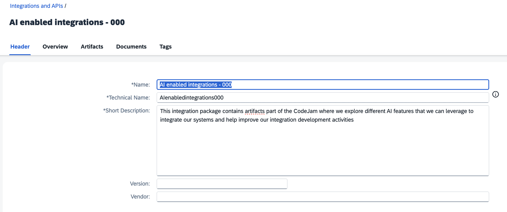
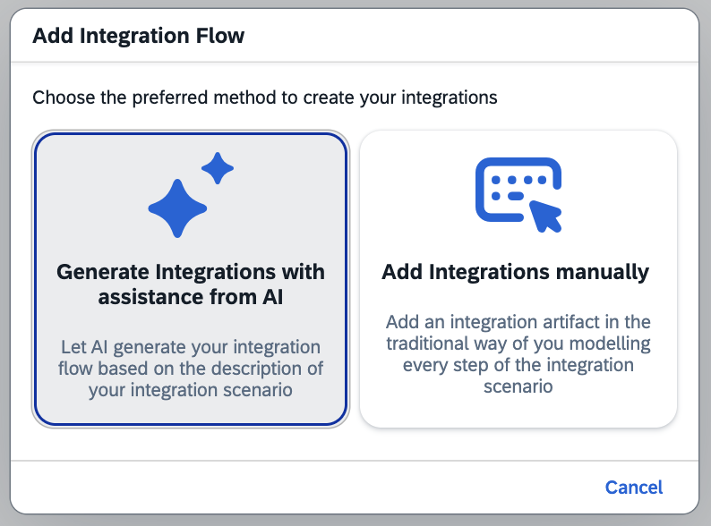
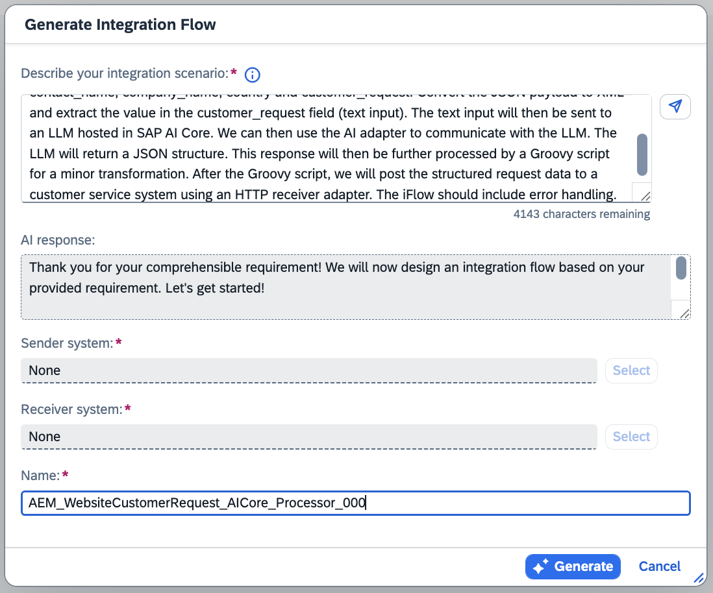
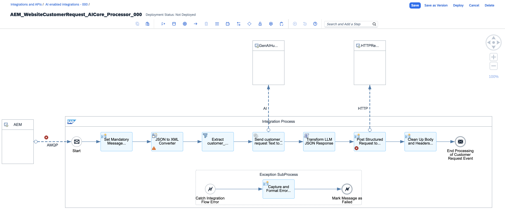
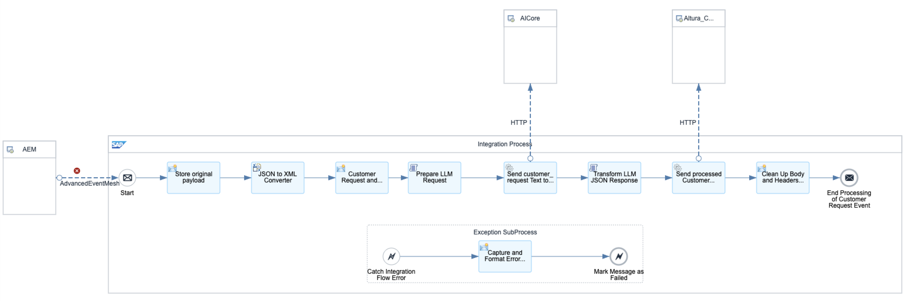
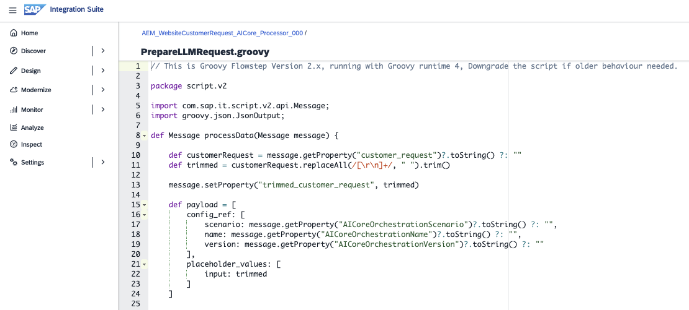
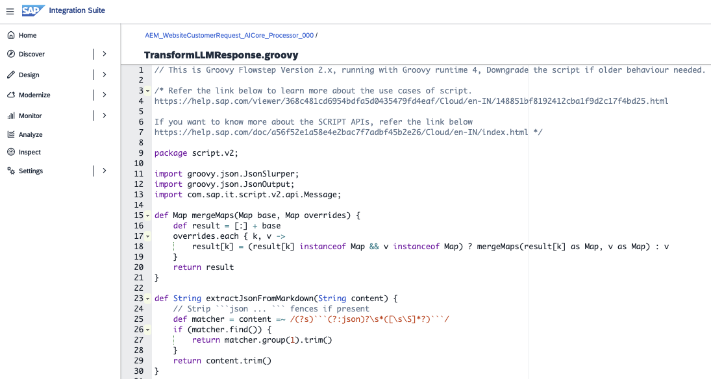
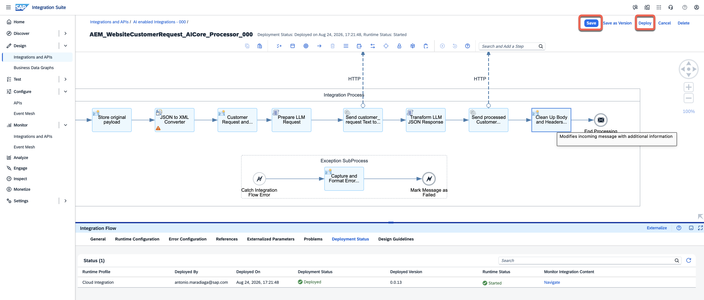
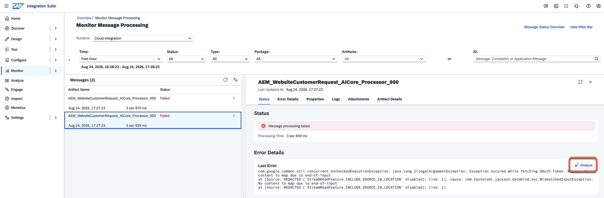

# Exercise 02 - Generate an iFlow

Now that we understand the integration scenario and what our prompt template produces, it is time to create the integration flow (iFlow) that will process incoming customer support requests. In this exercise, we will use the **Integration Flow Generation** feature in SAP Integration Suite to create an initial iFlow from a natural language description, and then refine it to fit our scenario.

At the end of this exercise, you'll have a deployed iFlow that receives a customer support request, leverages an LLM in SAP AI Core to extract the relevant information from the customer request input, and posts the structured response to the customer service system.

> [!IMPORTANT]  <br/>System details and credentials required to complete this exercise 🔐 <br/><br/>
>
> | System | URL | Username | Password |
> | ---- | ---- | ---- | ---- |
> | SAP Integration Suite | ${credentialsObj.intsuite.url} | ${credentialsObj.ias.user} | ${credentialsObj.ias.password} |
>
> <br/>*If prompted to select an identity provider, always select* ***a7rg4vxjp.accounts.ondemand.com***.

## Integration Flow Generation

SAP Integration Suite includes an AI-powered feature called **Generation of Integrations** that allows you to describe an integration scenario in natural language and have the system generate an initial iFlow for you. This can significantly speed up the initial setup, though you will typically need to adjust and configure the generated flow to match your specific requirements.

> [!NOTE]
> Integration Flow Generation uses embedded AI to interpret your description and translate it into an iFlow. The quality of the generated flow depends heavily on the clarity and specificity of your prompt. The more context you provide, the closer the initial result will be to what you need.

## Generate the iFlow

👉 Navigate to [SAP Integration Suite](${credentialsObj.intsuite.url}) and go to **Design > Integrations and APIs**. Now, create a new Integration Package, name it <dynamic>AI enabled integrations - ${credentialsObj.alturawebsite.user}</dynamic> and select the **Save** button.



👉 Now, navigate to the **Artifacts** tab the package, select **Add** and **Integration Flow**. In the pop-up select the **Generate Integration** button.



👉 Use the prompt below to describe the integration flow we want to generate. Select the **Send** button.

```text
Generate an iFlow that will connect to SAP Integration Suite, advanced event mesh to consume customer requests received in the
altura/website/support/request/v1/submitted/ai-integrations-${credentialsObj.alturawebsite.user} topic. The event published to the topic is a JSON payload will contain various fields:
contact_name, contact_email, country and customer_request. Convert the JSON payload to XML and extract the value in the customer_request field
(text input). The text input will then be sent to an LLM hosted in SAP AI Core. We can then use the AI adapter to communicate with the LLM.
The LLM will return a JSON structure. This response will then be further processed by a Groovy script for a minor transformation. 
After the Groovy script, we will post the structured request data to a customer service system using an HTTP receiver adapter.
The iFlow should include error handling.
```

Now Cloud Integration will process the prompt and give us the option to name the integration flow. Enter a name, e.g. <dynamic>AEM_WebsiteCustomerRequest_AICore_Processor_${credentialsObj.alturawebsite.user}</dynamic>. When ready, select the **Generate** button to create the iFlow.



> [!NOTE]
> By nature Generative AI is non-deterministic. Meaning that the iFlow generated may vary each time. The important thing at this stage is to get started with core flow structure. We can always adjust and refine the generated flow in the next steps.
> 
> 

👉 Review the generated iFlow. You should see something similar to the following steps:

1. AEM sender (receives incoming request)
2. AI adapter (calls the LLM in SAP AI Core)
3. Groovy script (transforms the response)
4. HTTP receiver (posts the structured request data to the customer service system)

## Configure the iFlow

Although the generated iFlow has a very similar structure to what we need, it requires a few changes for it to fulfill our integration needs. That said, it gives us a good starting point and saves us time in creating the initial flow. Now, let's configure the iFlow to match the ***Target iFlow*** below.



> [!TIP]
> In the tenant, the integration package called <dynamic>AI enabled integrations - 000</dynamic> is available. You can use this package as a reference to compare the iFlow you work for with the ***Target iFlow***.

### AdvancedEventMesh sender adapter

> [!WARNING]
> It is possible that the generated iFlow may not include an AEM sender adapter and instead shows an AMQP connection. If this is the case, you will need to remove the existing connection and add one manually. To do this, drag the connection from AEM sender system to the Start message event node. In the pop-up dialog, select the **AdvancedEventMesh** adapter type.

The iFlow will be kicked off by the AEM adapter step, but it will need to be configured with the correct connection details for the AEM instance that has been provided for the CodeJam.

👉 Choose the AEM adapter step in the iFlow and open its configuration panel. Set the following properties:

| Property | Value |
|----------|-------|
| ***Connection*** *tab* |
| Host | ${credentialsObj.aem-eu-north-broker.url} |
| Message VPN | ${credentialsObj.aem-eu-north-broker.name} |
| Username | ${credentialsObj.aem-eu-north-broker.user} |
| Authentication Type | Basic |
| Password Secure Alias | ${credentialsObj.aem-eu-north-broker.password} |
| ***Processing*** *tab*|
| Consumer Mode | Direct |
| Run on a single worker node? | ✅ |
| Topic Subscriptions | altura/website/support/request/v1/submitted/ai-integrations-${credentialsObj.alturawebsite.user} |
| Maximum Message Processing attemsp | 2 |

### Store original payload - Content Modifier

In the Content Modifier, the **Exchange Property** tab should be used to store the original payload. Set the following properties:

| Action | Name | Source Type | Source Value | Data Type | Default Value |
|--------|------|-------------|--------------|-----------|---------------|
| Create | originalBody | Expression | ${in.body} | java.lang.String |  |

### JSON to XML Converter

In the **Processing** tab, set the following properties:

| Property | Value |
|----------|-------|
| Use namespace mapping | ✅ |
| Add XML root element | ✅ |

### Customer Request and LLM properties - Content Modifier

Here we will be preparing for the request to SAP AI Core and most of the configuration is set here. Set the following properties:

- **Message Header** tab
  
    | Action | Name | Source Type | Source Value | Data Type | Default Value |
    |--------|------|-------------|--------------|-----------|---------------|
    | Create | Content-Type | Constant | `application/json` |  |  |
    | Create | AI-Resource-Group | Constant | `${credentialsObj.aicore.user}` |  |  |

- **Exhange Property** tab

    | Action | Name | Source Type | Source Value | Data Type | Default Value |
    |--------|------|-------------|--------------|-----------|---------------|
    | Create | AICoreOrchestrationVersion | Constant | `0.0.3` |  |  |
    | Create | AICoreOrchestrationName | Constant | `AI_Integrations_CustomerSupportRequest_Configuration` |  |  |
    | Create | AICoreOrchestrationScenario | Constant | orchestration |  |  |
    | Create | customer_request | XPath | `/root/data/customer_request` | `java.lang.String` |  |

### Prepare LLM Request - Groovy script

When interacting with the SAP AI Core API, we need to send a JSON payload with a specific structure. We will use a Groovy script to prepare this payload. The script does the following:

- Trim the customer request so that is set properly in the JSON payload.
- Sets the values configured in the previous Content Modifier.
- Log the to be sent payload for debugging purposes.

👉 Copy the contents of [PrepareLLMRequest.groovy](assets/PrepareLLMRequest.groovy) and paste it in the Groovy script step.



### AICore - HTTP receiver adapter

The generated iFlow will include an AI adapter step, but we will not be able to call a template. Instead, we will call the API directly and for that we will use the HTTP adapter. Set the following values in the configuration panel:

- Connection tab
  
  | Property | Value |
    |----------|-------|
    | Address | ${credentialsObj.aicore-api.url}/deployments/${credentialsObj.aicore-api.user}/v2/completion |
    | Proxy Type | Internet |
    | Method | POST |
    | Authentication Type | OAuth2 Client Credentials |
    | Credential Name | ${credentialsObj.aicore-api.password} |
    | Request Headers | `traceparent, AI-Resource-Group, Accept, Content-Type` |

### Transform LLM JSON Response - Groovy script

The SAP AI Core API response needs to be transformed into a payload that matches what the Customer Request Service system API expect. We will use a Groovy script to prepare this payload. The script does the following:

- Extracts the `response` from the LLM (a JSON payload), which is within the nested structure and converts it from a string to a JSON object.
- Merges the original payload with the LLM response to create a new JSON payload. Also, do some clean up of the target payload.
- Log the final payload for debugging purposes.

👉 Copy the contents of [TransformLLMResponse.groovy](assets/TransformLLMResponse.groovy) and paste it in the Groovy script step.



### Altura_CustomerService_API - HTTP receiver adapter

Now that our payload is in the correct format, we can send it to the Customer Service system API. Set the following values in the configuration panel:

- Connection tab
  
    | Property | Value |
    |----------|-------|
    | Address | <dynamic>${credentialsObj.alturacs-api.url}/customer-requests/CustomerRequests</dynamic> |
    | Proxy Type | Internet |
    | Method | POST |
    | Authentication | None |

> [!WARNING]
> In the Target iFlow screenshot there is an additional Content Modifier step after the call to the Customer Service system API. This step is not required for the CodeJam and can be ignored.

## Deploy and test the iFlow

👉 **Save** and **Deploy** the iFlow by choosing the button in the top right corner. 



Once deployed, navigate to **Monitor > Integrations and APIs**. Select the **Cloud Integration** runtime > **Manage Integration Content - All** to verify that the deployment was successful.

👉 Go to the [Altura's Coffee website](${credentialsObj.alturawebsite.url}) to send a customer request. Use the sample request from Exercise 00:

| Field | Value |
|-------|-------|
| Username | <dynamic>ai-integrations-${credentialsObj.alturawebsite.user}</dynamic> |
| Contact Name | ${userDetails.firstName} ${userDetails.lastName} |
| Contact Email | ${userDetails.email} |
| Country | Select your country, e.g. Spain |
| Request | Text below |


```text/plain
Hi customer support from Altura,

We have a La Marzocco Micra in the Plaza Pablo Picasso office in Madrid 28020, 
which is not extracting coffee as it should. Can you please send a technician to 
check the machine.

Also, we are running out of filters for the MoccaMaster that we have in the 
Castellana 85 office. Can you please send us a couple of boxes so that we have 
plenty of filters.

Thank you,
${userDetails.firstName} ${userDetails.lastName}
```

👉 Check the [customer request service system](${credentialsObj.alturacs.url}) to see if a new entry has appeared with the structured request data.

## AI-assisted error resolution

If the request fails, check the **Monitor > Integrations and APIs**. Select the **Cloud Integration** runtime > **All Artifacts** in SAP Integration Suite and inspect the message processing log for your iFlow. This will show you exactly where the failure occurred.

Here we can leverage the [**AI-assisted error resolution** feature](https://help.sap.com/docs/integration-suite/isuite-integrations-and-apis/ai-assisted-error-resolution?locale=en-US) in SAP Integration Suite. This feature uses AI to analyze the error and provide suggestions for resolving it.



## Summary

We now have a working iFlow that receives an unstructured customer support request, processes it through an LLM in SAP AI Core, and posts the structured result to the customer service system. The Integration Flow Generation feature gave us a good starting point, which we then configured to match our specific scenario.

In the next exercise, we will work on the Groovy script that does the transformation, and we will use the Script Optimization feature to improve it.

## Further Study

* [Generating Integration Flows with AI Assistance](https://help.sap.com/docs/integration-suite/isuite-integrations-and-apis/generating-integration-flows-with-ai-assistance?version=CLOUD)
* [Optimize Groovy Scripts with AI](https://help.sap.com/docs/integration-suite/isuite-integrations-and-apis/optimize-groovy-scripts-with-ai?version=CLOUD&ai=true)
* [AI-assisted error resolution](https://help.sap.com/docs/integration-suite/isuite-integrations-and-apis/ai-assisted-error-resolution?locale=en-US)
* [AI receiver adapter in SAP Cloud Integration](https://help.sap.com/docs/integration-suite/isuite-integrations-and-apis/ai-receiver-adapter?locale=en-US)

---

If you finish earlier than your fellow participants, you might like to ponder these questions. There isn't always a single correct answer and there are no prizes - they're just to give you something else to think about.

1. The Integration Flow Generation feature saved us time in creating the initial iFlow structure. Can you identify any steps that were generated incorrectly or that needed adjustment? What does this tell you about the current limitations of AI-generated integration flows?
2. Our iFlow receives plain text as input. What changes would be needed if the input were a JSON payload with multiple fields (e.g. `contact_name`, `contact_email`, `customer_request`)?
3. We are passing the entire customer message directly to the LLM. What are the security and privacy implications of this approach?

## Next

Continue to 👉 [Exercise 03 - Optimise script in iFlow](exercises/03-optimise-script-iflow/README.md)
