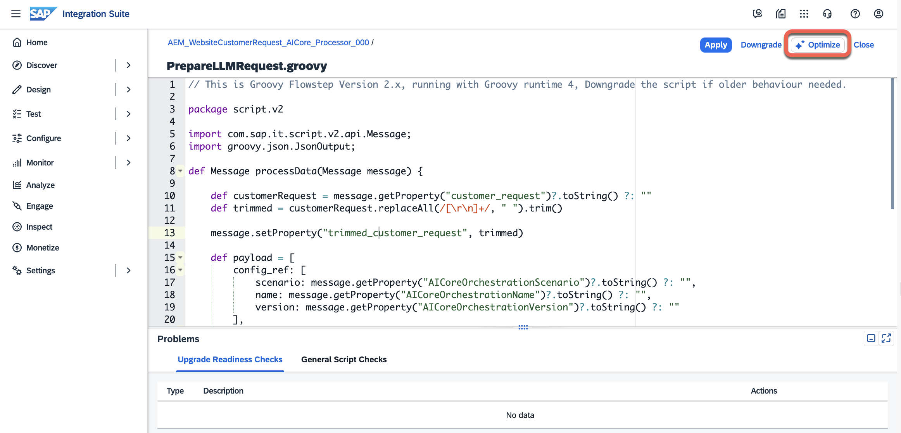
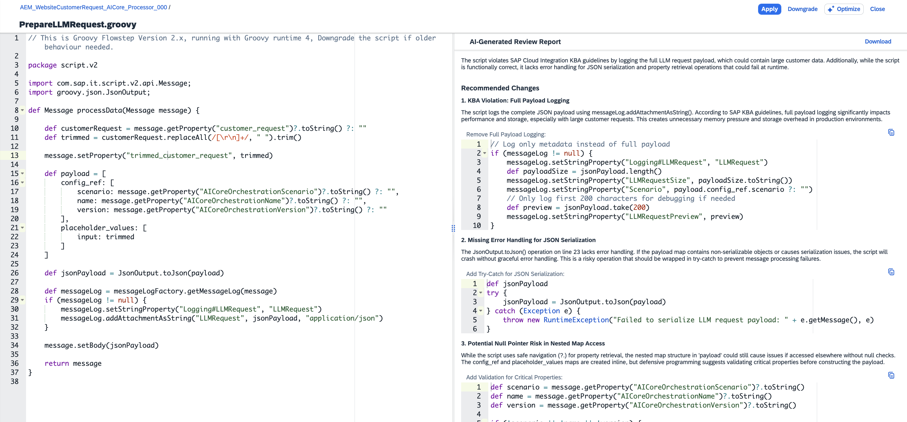

# Exercise 03 - Optimise script in iFlow

In the previous exercise, we included a couple of Groovy scripts in our iFlow. Now we will explore the **Script Optimisation** feature in SAP Integration Suite to improve them. Script Optimisation is a Generative AI feature that helps you improve Groovy scripts in the script editor by focusing on resource usage. In essence, it helps make our scripts more performant.

At the end of this exercise, you'll have an iFlow with an optimised Groovy script, and you'll have seen how the Script Optimisation feature can help improve the quality of code written for integration flows.

> [!IMPORTANT]   Credentials required to complete this exercise 🔐   
>
> | System | URL | Username | Password |
> | ---- | ---- | ---- | ---- |
> | SAP Integration Suite | ${credentialsObj.intsuite.url} | ${credentialsObj.ias.user} | ${credentialsObj.ias.password} |
>
>  *If prompted to select an identity provider, always select* ***a7rg4vxjp.accounts.ondemand.com***.

## Groovy scripts in the iFlow

We have two Groovy scripts in our iFlow:

- `PrepareLLMRequest.groovy`: This script prepares the request to be sent to the SAP AI Core API. It simply trims the original customer request and defines the structured JSON payload.
- `TransformLLMResponse.groovy`: Responsible for transforming the response from the SAP AI Core API. Extracts the JSON payload from the response and prepares the payload needed to create a new service request in the customer service system.

## Use the Script Optimisation feature

Now that we are familiar with the scripts, let's see how the Script Optimisation feature can help improve them.

👉 Open the `PrepareLLMRequest.groovy` script and choose the **Optimize** button.

A report will be generated with suggestions for improving the script. Some typical suggestions you might see include:

- Make logging payloads conditional
- Log payload metadata instead of the entire payload
- Proper error handling

After the suggestions, we will find an improved script section which addresses the issues raised. We can copy this payload and replace the original script with it. We can also choose to apply only some of the suggestions. This will need to be done manually.

> [!TIP]
> 🧭 Script Optimisation suggestions are not always applicable to every scenario. It is important to understand *why* a suggestion is being made before applying it. Some suggestions can improve performance at scale but might not be that impactful for small payloads or iFlows that will run a couple of times per day, like the ones in this CodeJam.

👉 The developer 🧑‍💻 is always in the loop ➰.... Apply the suggestions that make sense for our scenario and verify that the iFlow still functions correctly after the changes.

👉 Now repeat the same process for the `TransformLLMResponse.groovy` script.

## Verify the end-to-end flow

After applying any script changes, always **Save**, **Deploy** and re-test the iFlow.

👉 Send a new customer request via the [website](${credentialsObj.alturawebsite.url}):

👉 Check the monitoring view to confirm the message was processed without errors.

👉 Check the [customer service system](${credentialsObj.alturacs.url}) to confirm the new request has been created.

## Summary

We are now familiar with the Script Optimisation feature and applied relevant improvements to our code. This AI-assisted code improvement is a good example of how AI features in SAP Integration Suite can improve development.

In the next exercise, we will shift focus to MCP and explore how the customer service system exposes an MCP server before diving on the MCP Gateway functionality.

## Further Study

* [Script Use Cases](https://help.sap.com/docs/integration-suite/isuite-integrations-and-apis/script-use-cases?locale=en-US)
* [Script Optimisation in SAP Cloud Integration](https://help.sap.com/docs/integration-suite/isuite-integrations-and-apis/optimize-groovy-scripts-with-ai?locale=en-US)

---

If you finish earlier than your fellow participants, you might like to ponder these questions. There isn't always a single correct answer and there are no prizes - they're just to give you something else to think about.

1. Can you think of any iFlows you are currently running that could benefit from the Script Optimisation feature?
2. The Script Optimisation feature uses an LLM to suggest improvements. Can you think of cases where following the LLM's suggestions could actually make the code worse?
   

    
⇟ Hint 🔦

    <i>Consider suggestions that are generically correct for large-scale production systems but introduce unnecessary complexity for simple, short-lived integration scripts. Also think about cases where the LLM might not understand the specific constraints of the Cloud Integration runtime environment.</i>
   

## Next

Continue to 👉 [Exercise 04 - Customer Service system API as MCP server](../04-customer-service-api-mcp-server/README.md)
