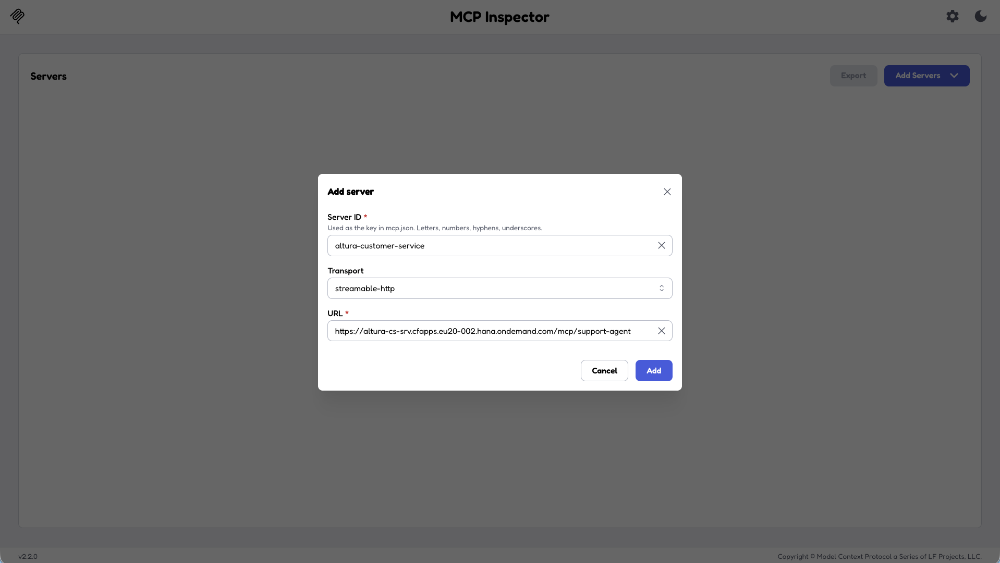
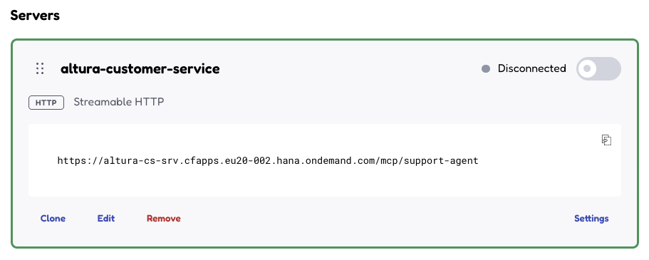
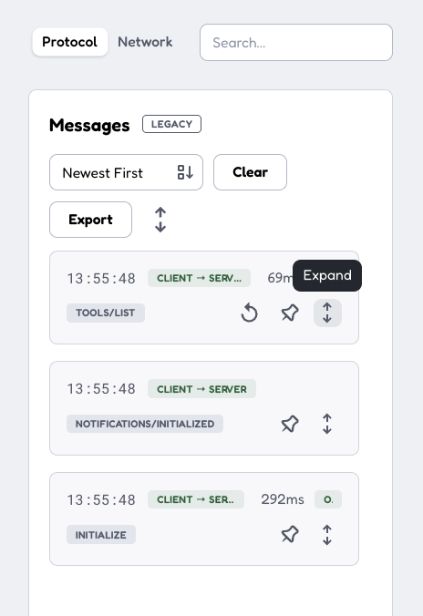
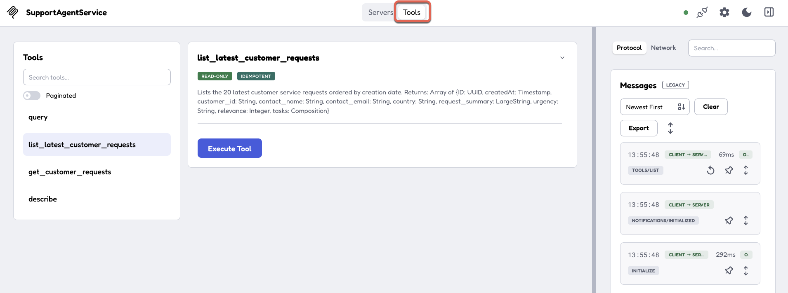
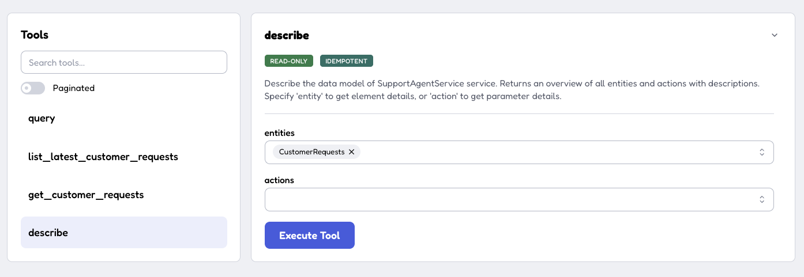
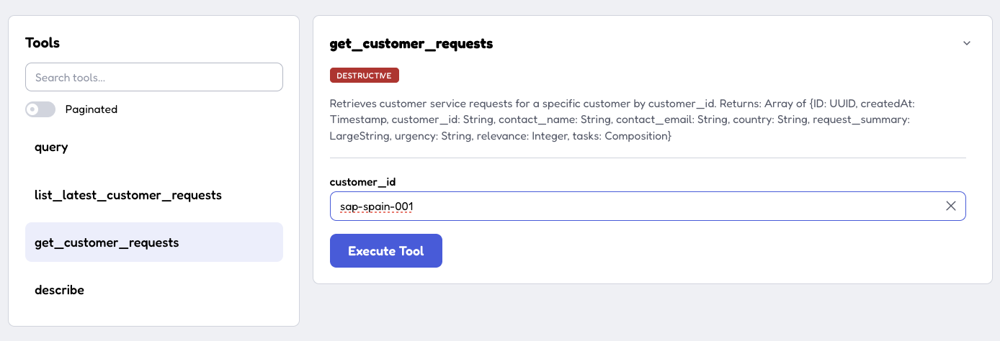
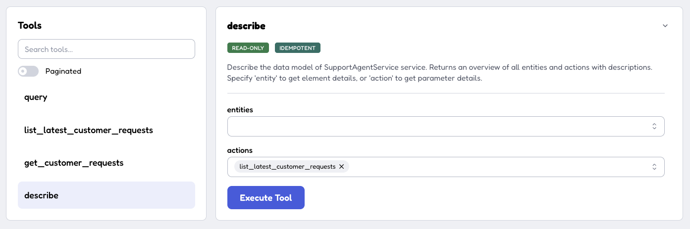
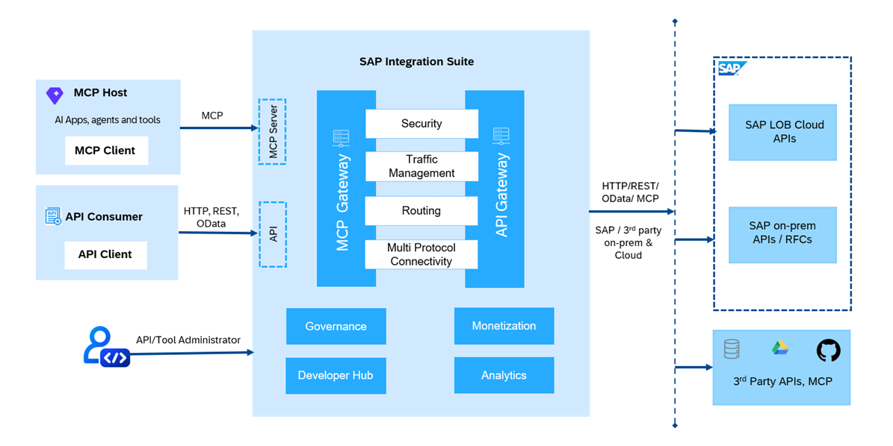

# Exercise 04 - Customer Service system API as MCP server

We have now built an integration flow that processes customer support requests and sends them to the customer service system. In this exercise, we will shift our focus to **MCP Servers** and explore how the customer service system already exposed as an **MCP server**. We will get familiar with the MCP protocol and the principles behind the MCP Gateway in SAP Integration Suite.

At the end of this exercise, you'll have an understanding of how API Management's MCP Gateway works, what an MCP server is in this context, and how the customer service system MCP is made available as a set of tools that an LLM can invoke.

> [!IMPORTANT]  <br/>System details and credentials required to complete this exercise 🔐 <br/><br/>
>
> | System | URL |
> | ---- | ---- |
> | ${credentialsObj.alturacs-api.name} MCP | <dynamic>${credentialsObj.alturacs-api.url}/mcp/support-agent</dynamic> |
>
> <br/>*If prompted to select an identity provider, always select* ***a7rg4vxjp.accounts.ondemand.com***.

## What is MCP?

[Model Context Protocol (MCP)](https://modelcontextprotocol.io/introduction) is an open-source standard for connecting AI applications to external systems. The protocol was initially created by Anthropic which was adopted by other AI companies such as OpenAI and Google.

Using MCP, AI applications like Open WebUI, Claude or ChatGPT can connect to data sources (e.g. local files, databases), tools (e.g. search engines, calculators) and workflows (e.g. specialized prompts) — enabling them to access key information and perform tasks. Although MCP is widely used to access local tools, e.g. file system, CLI, our focus will be on how MCP can be used to access remote resources, e.g. enterprise APIs and services. Remote MCP servers extend AI applications’ capabilities beyond your local environment, providing access to internet-hosted tools, services, and data sources.

The protocol defined two standard transport mechanisms:

1. **stdio**, for local communication over standard in and out.
2. **Streamable HTTP**, for remote communication over HTTP. This transport uses HTTP POST and GET requests that we are all very familiar with.

MCP uses JSON-RPC to encode messages. JSON-RPC messages MUST be UTF-8 encoded.


### MCP Inspector

The MCP Inspector is a developer tool that allows exploring and testing MCP servers. It is available in the browser, on the command line, and in the terminal. As part of this CodeJam we will use the MCP Inspector to explore the MCP servers that is available and the one we will create in the next exercise.

👉 Install the MCP inspector in your local environment. Follow the instructions available here: <https://modelcontextprotocol.io/docs/2026-07-28/tools/inspector>

The easiest way to run MCP Inspector is via `npx`. `npx` (Node Package eXecute) is a command-line tool bundled with npm that allows you to execute Node.js packages without installing them globally or permanently in a project:

```bash
$ npx @modelcontextprotocol/inspector

# --- 
# It will automatically open in a browser
# ---

Starting MCP inspector...

MCP Inspector Web is up and running at:
   http://localhost:6274?MCP_INSPECTOR_API_TOKEN=22496....

   Sandbox (MCP Apps): http://localhost:65125/sandbox

   Auth token: 22496....

Opening browser...
```

> [!NOTE]
> The first time you run MCP Inspector, there will be a couple of servers listed, one for your file system and another one called everything server. You can safely ignore them or remove them, if you prefer to start from scratch. These servers use the STDIO protocol meaning that they run locally on your machine and as you can see from their configuration, they will just run two other npx commands.

## The customer service application and its MCP functionality

The customer service application used in this CodeJam is a [CAP (Cloud Application Programming model)](https://cap.cloud.sap/docs/) application. CAP applications automatically expose OData and REST APIs for the entities they define and it recently added support for MCP. By incorporating the [CAP MCP adapter](https://cap.cloud.sap/docs/guides/protocols/mcp), the customer service application can now be accessed as an MCP server.

> [!WARNING]
> **What about the SAP API Policy?** SAP API Policy Applies!
> 
> The CAP MCP adapter, is designed exclusively to expose custom CAP application services via MCP. It is not an SAP-endorsed architecture, data service, or service-specific pathway for purposes of section 2.2.2 of the SAP API Policy, and should not be relied upon as a basis for compliance with any exception described in that section. In particular, it is not an endorsed pathway for exposing, proxying, or providing agentic access to SAP Application APIs via MCP. For SAP-endorsed architectures covering agentic access to SAP APIs, refer to the reference architectures published on the SAP Architecture Center. *Source: [CAP MCP Adapter](https://cap.cloud.sap/docs/guides/protocols/mcp)*.

In our case, the customer service system exposes MCP functionality that allows you to:

- List all customer service requests
- Create a new customer service request
- Retrieve a specific request by customer ID

👉 Add the Customer Service MCP to MCP Inspector by choosing the **Add Server** button. Enter the details and finalise by selecting the **Add** button.



👉 Once added, choose the Connect toggle



👉 Once connected, the tool will automatically make a couple of calls to the MCP server to initialise the communication and retrieve the list of available tools. 



👉 Now, switch to the **Tools** tab by choosing the tab option on the top of the screen. You should see the following tools available:

- query
- list_latest_customer_requests
- get_customer_requests
- describe



The `list_latest_customer_requests` and `get_customer_requests` are a function and action, respectively, exposed by the service. What about the query and describe tools? These tools are [available out of the box](https://cap.cloud.sap/docs/guides/protocols/mcp#mcp-served-out-of-the-box) for any CAP application that adopts MCP adapter.

- `describe`: This tool returns information about the entities and their elements exposed by the service. It also returns information about unbound actions and functions.
- `query`: This tool is used to read data from the service. The only required parameter is entity, an enum that lists all entities exposed by the service. This tool takes all provided parameters and translates them to a CQN query, which the service runs via `service.run(query)`.

👉 Explore the MCP server further by completing the tasks below. Get familiar with the responses and think about how this can help an LLM when interacting with the MCP server.

- Describe the `CustomerRequests` entity
  
- List the last 20 customer requests received by the service.
- Get the customer requests for `sap-spain-001`.
  
- Describe the `list_latest_customer_requests` function.
  

> [!NOTE]
> We are now familiar with the basic functionality of the MCP inspector tool. As mentioned above, we are using streamable HTTP to interact with remote MCP servers. In the next exercise, we will use an HTTP tool, such as Bruno, to call an MCP server that we will create in the MCP Gateway. Also, we will explore the GET and POST requests that are sent to the MCP server so we can understand how the communication works under the hood.

## The MCP Gateway

In SAP Integration Suite, the MCP Server capability is realized through the MCP gateway. The MCP gateway acts as the runtime layer that exposes enterprise APIs, tools, and backend services as MCP-compatible endpoints for AI agents. It provides capabilities such as security, traffic management, routing, and multi-protocol connectivity while enabling governed access to enterprise systems. Similarly, the API gateway enables secure and governed access to APIs for traditional API consumers. Both gateways share common capabilities such as security, traffic management, and multi-protocol connectivity.



The MCP Gateway is part of the new Integration Cell runtime. Integration Cell is a managed, cloud-native runtime for deploying and running APIs and MCP Servers on SAP-managed infrastructure.

- **API artifacts** allow you to expose backend services through managed API endpoints with built-in security, traffic management, and lifecycle governance.
- **MCP server artifacts** enable you to expose enterprise capabilities and data through the Model Context Protocol (MCP), making them accessible to AI-powered applications and agents.

An MCP server on Integration Cell enables AI agents to securely access and interact with enterprise systems. You can create an MCP server from the following source types:

- **APIs**: Create an MCP server from an API artifact deployed on Integration Cell.
- **HTTP Endpoint with OpenAPI Specification**: Create an MCP server from any HTTP endpoint by providing the endpoint URL and an OpenAPI specification.
- **RFCs**: Create an MCP server from an RFC-based backend by modeling and exposing RFC operations as MCP tools.

> [!TIP]
> 🧭 The quality of tool descriptions in an MCP server is important for LLM tool use. Clear, concise descriptions help the LLM decide when to call a tool and what parameters to provide. If you find that the LLM makes mistakes when calling a tool, improving the tool description is often the first thing to try.

## Summary

We are now familiar with the MCP protocol and have interacted with an MCP server exposed by a CAP application. We've learnt that the CAP MCP adapter can be used to extend the functionality of our existing CAP application and empower AI assistants.

In the next exercise, we will add an API to API Management and expose it via the MCP Gateway - this time, the Service Centre Locator API.

## Further Study

* [Model Context Protocol specification](https://modelcontextprotocol.io/specification)
* [MCP - Transports](https://modelcontextprotocol.io/specification/2025-03-26/basic/transports)
* [How Model Context Protocol (MCP) Server Enables AI Integration](https://help.sap.com/docs/integration-suite/isuite-integrations-and-apis/how-model-context-protocol-mcp-enables-ai-integration-with-apis?locale=en-US)
* [CAP MCP Adapter](https://cap.cloud.sap/docs/guides/protocols/mcp)

---

If you finish earlier than your fellow participants, you might like to ponder these questions. There isn't always a single correct answer and there are no prizes - they're just to give you something else to think about.

1. MCP tools have names and descriptions that help the LLM understand what they do. Who is responsible for writing these descriptions - the service/API developer, the API Management administrator, or the Agent building team? What are the implications of each approach?
2. The MCP Gateway handles authentication between the LLM client and the API. What security considerations would you have before exposing a production API as an MCP server?
3. The customer service system already exposes an MCP server. Can we import this MCP server in the MCP Gateway?
4. CAP applications automatically generate APIs from data model definitions. What are the advantages and disadvantages of using auto-generated APIs as MCP tools compared to manually designed APIs? Would it be better to expose a simplified API for LLM use, or the full API with all operations?

## Next

Continue to 👉 [Exercise 05 - Expose existing API via MCP Gateway](exercises/05-expose-api-mcp-gateway/README.md)
