# Exercise 05 - Expose existing API via MCP Gateway

In the previous exercise, we explored how the customer service system API is already exposed as an MCP server. We are also now familiar with MCP Inspector and how we can interact with an MCP server. Now we will explore how we can expose an existing API as an MCP server: the **Service Centre Locator API**. This API allows us to find the nearest Altura Coffee Co. service centre for a given location, and we will add it to API Management and expose it via the MCP Gateway.

At the end of this exercise, you'll have the Service Centre Locator API configured as an MCP server via API Management and running in the new Integration Cell runtime. The MCP server will then be ready to be used as a tool by our LLM client.

> [!IMPORTANT]   System details and credentials required to complete this exercise 🔐   
>
> | System | URL | Username | Password |
> | ---- | ---- | ---- | ---- |
> | Altura Service Center Locator API | ${credentialsObj.altura-service-center-locator.url} | <dynamic>${credentialsObj.ias.user}</dynamic> | <dynamic>${credentialsObj.ias.password}</dynamic> |
> | SAP Integration Suite | ${credentialsObj.intsuite.url} | <dynamic>${credentialsObj.ias.user}</dynamic> | <dynamic>${credentialsObj.ias.password}</dynamic> |
>
>  *If prompted to select an identity provider, always select* ***a7rg4vxjp.accounts.ondemand.com***.

## The Service Centre Locator API

The Service Centre Locator API is a service made available for this CodeJam. Given an address, it returns the nearest Altura Coffee Co. service centres along with their contact details and estimated travel distance.

👉 Before configuring the API proxy, test the API directly to understand what it does. Get familiar with the requests available in Bruno for the Service Center Locator API.

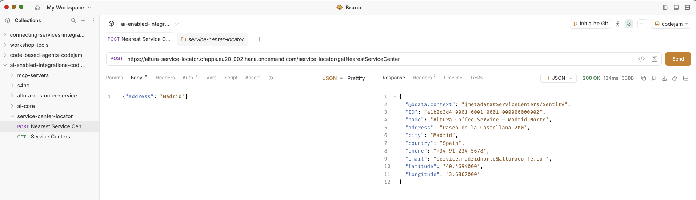

Once you have explored the API, you should be able to answer the following questions:

- How do I authenticate with the API?
- How can I retrieve all service centres?
- How can I find the closest service centres for a given location?
- What can I send as input to get the nearest service centres?

> [!NOTE]
> If you want to check out the service under the hood, the CAP service is available in the `https://github.com/SAP-samples/ai-enabled-integrations-codejam/tree/main/apps/altura-service-locator` folder.

## Create an MCP server in API Management

Now that we are familiar with the Service Centre Locator API, lets proceed to creating an MCP server based on its OpenAPI specification.

👉 Navigate to **Design** > **Integrations and APIs**, select the integration package created in exercise 2. Enter edit mode by choosing the **Edit** button located on the top right hand side of the screen. Then, in the **Artifacts** tab, choose **Add** > **MCP Server**.

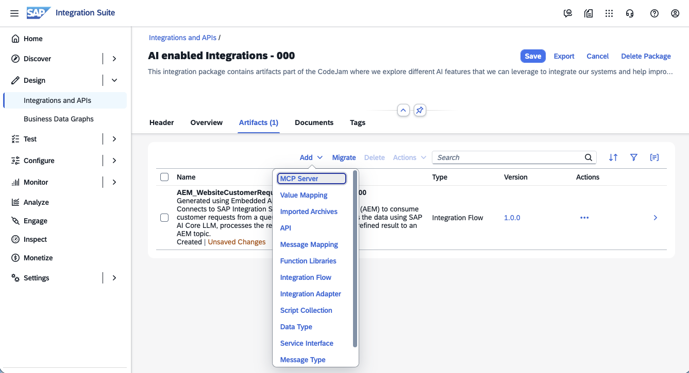

> [!NOTE]
> We can create an MCP server from the following source types:
>
> - **APIs**: Create an MCP server from an API artifact deployed on Integration Cell.
> - **HTTP Endpoint with OpenAPI Specification**: Create an MCP server from any HTTP endpoint by providing the endpoint URL and an OpenAPI specification.
> - **RFCs**: Create an MCP server from an RFC-based backend by modeling and exposing RFC operations as MCP tools.

In the pop-up dialog, select **HTTP Endpoint with OpenAPI specification** and click **Next**.

👉 Provide MCP details below

| Property | Value |
|----------|-------|
| Method | **Upload** |
| File | The OpenAPI specification is available here - [YAML](/files/ServiceCenterLocator-OpenAPI.yaml ':ignore :target=_self') or [JSON](/files/ServiceCenterLocator-OpenAPI.json ':ignore :target=_self') |
| URL | ${credentialsObj.altura-service-center-locator.url}/service-locator |
| ***General*** |
| Name | <dynamic>ServiceLocator_${credentialsObj.alturawebsite.user}</dynamic> |
| ID | <dynamic>ServiceLocator_${credentialsObj.alturawebsite.user}</dynamic> |
| MCP Path | <dynamic>/service-locator-mcp-${credentialsObj.alturawebsite.user}</dynamic> |
| Version | 1.0.0 |
| Runtime profile | Integration Cell |

> [!WARNING]
> The Service Centre Locator OpenAPI specification used in this exercise is slightly different from the one generated by the CAP service - available [here](https://github.com/SAP-samples/ai-enabled-integrations-codejam/tree/main/apps/altura-service-locator/assets/service-locator-cap/docs/ServiceLocatorService.openapi3.json). We encourage you to check the differences and see how we modified it to play nicely with LLMs. For example, LLMs can get confused when dealing with object types. Also, it might hallucinate structures that are not part of the API. Debugging the LLM output can be challenging, but you can always ask the LLM to provide the input and output of a specific tool and this can guide you to understand what the LLM is doing.

👉 Select **GET /ServiceCenters** and **POST /getNearestServiceCenter** as tools and choose the **Add** button.

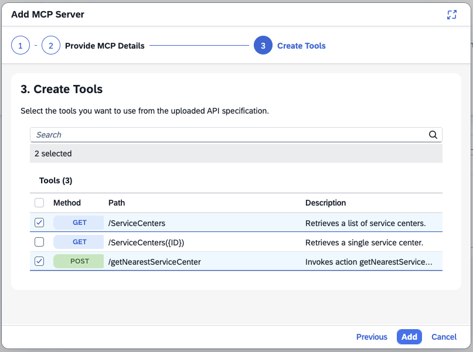

👉 Now, navigate to the **MCP Configuration** tab.

Take your time to review the MCP configuration available. Check out the contents of the Source, Tools, Resources, and Prompts tabs. Pay close attention to the details here as they will be used as part of the MCP tool definition and will help the LLM understand what parameters to provide when calling the tool.

> [!NOTE]
> Remember the tools, resources, and prompts exposed by the CAP service out of the box? How do they compare?

👉 Navigate to the **Policies** tab.

There are two policies before making the call to the underlying service. Get familiar with the Authentication and Authorization policies in the artifact editor and their configuration.

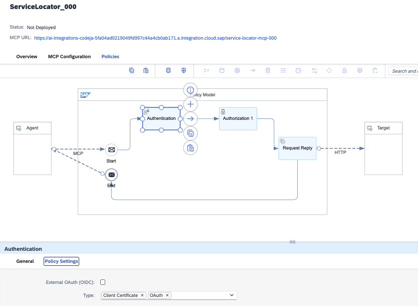

For an MCP artifact, we can add the following policies:

- ***Security***: 
  - *Authentication*: Authenticate consumers using supported mechanisms such as Basic authentication, Client Certificate, and OAuth.
  - *Authorization*: Authorize users by evaluating whether they are permitted to access the MCP.
- ***Traffic Management***:
  - *IP Filter*: Allow or deny calls from specific IP addresses or address ranges to restrict access based on network origin.
  - *Quota*: Enforce quotas by defining the number of request messages an application can submit to an API endpoint over a given period of time.
  - *Surge protection*: Protect the backend service against sudden traffic spikes by controlling the rate of incoming requests.

> [!WARNING]
> When we got familiar with the Service Centre Locator API, you might have noticed that it used basic authentication to authenticate requests. We need to configure this in the MCP artifact.

👉 Select the HTTP receiver adapter that connects the **Request Reply** node to the **Target** participant. In the **Connection** tab, specify the authentication details below.

| Property | Value |
|----------|-------|
| Authentication | Basic |
| Credential Name | ServiceLocator_BasicAuth |

> [!NOTE]
> The ServiceLocator_BasicAuth credential has been pre-configured and deployed. It contains the username and password required to authenticate with the Service Centre Locator API.

👉 Our configuration is ready, now choose the **Save** button and deploy the artifact by choosing the **Deploy** button.

Once deployed, the MCP artifact will be listed in the Manage Integration Content (**Monitor** > **Integration and APIs** > **Manage Integration Content** - **All**). An endpoint URL will be displayed for the MCP server, e.g. https://ai-integrations-codeja-5fa04ad0219049fd997c44a4cb0ab171.a.integration.cloud.sap/service-locator-mcp-${credentialsObj.alturawebsite.user}.

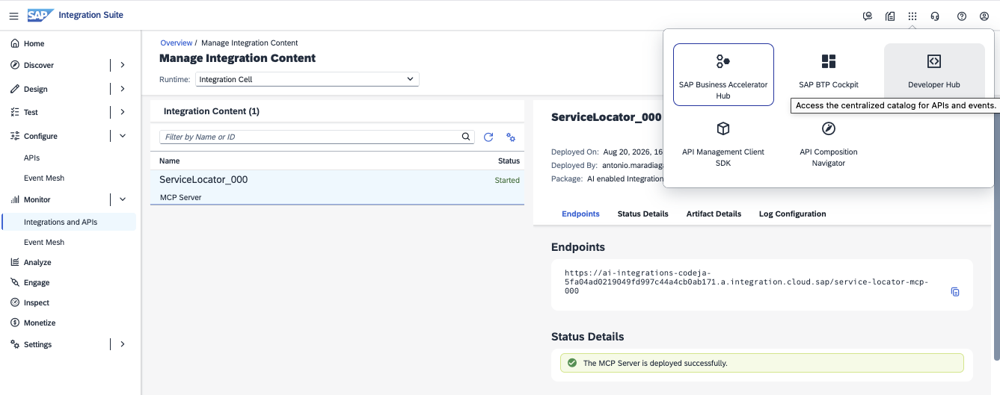

> [!IMPORTANT]
> 👉 Copy the MCP server endpoint URL as we will need it later to test the MCP server.

The MCP server is now ready but we don't have credentials to be able to call it. Let's create an API product in the Developer Hub to expose the MCP server and provide credentials to call it.

## Developer Hub

The Developer Hub is a web-based platform that serves as a centralized catalog for APIs, events, and MCP servers, empowering developers to discover, explore, and consume the integration capabilities offered by your organization. Acting as a unified and curated storefront, it consolidates APIs, events, and MCP servers in a single location, enabling application developers to discover, explore, and consume APIs and events, while enabling AI agents to discover and consume MCP servers.

We will now go ahead and create an MCP product in the Developer Hub. After we will subscribe to the product and this will generate credentials that we can use to call the MCP server.

### Create an MCP product

👉 In the Developer Hub, go to the **Admin Center** and select **Content**.

👉 In the **Business Systems** tab, select the Integration Suite available, e.g. *ai-integrations-codejam-2tmfbzpb*. Then, in the **MCP Servers** tab, we will find all the MCP servers available in the Integration Suite. Select the MCP server we just created, e.g. *ServiceLocator_${credentialsObj.alturawebsite.user}*, and choose **Create Product**.

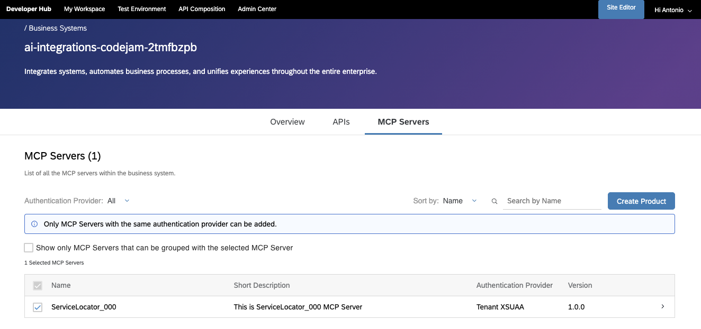

👉 Enter the details below in the pop-up dialog and choose **Publish** when done.

| Property | Value |
|----------|-------|
| Name | <dynamic>AlturaCoffee_${credentialsObj.alturawebsite.user}</dynamic> |
| ID | <dynamic>AlturaCoffee_${credentialsObj.alturawebsite.user}</dynamic> |
| Short Text | Altura Coffee MCP servers |
| Description | Exposes the Altura Coffee services as MCP servers |

Once submitted, the product creation process is triggered and it will take a minute or two for it to finalise. We can check the status in the Scheduled Requests (**Admin Center** > **Scheduled Requests**) view.

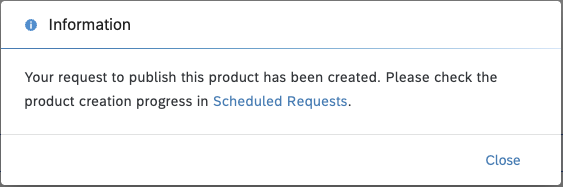

Once published, the product will be in the Developer Hub.

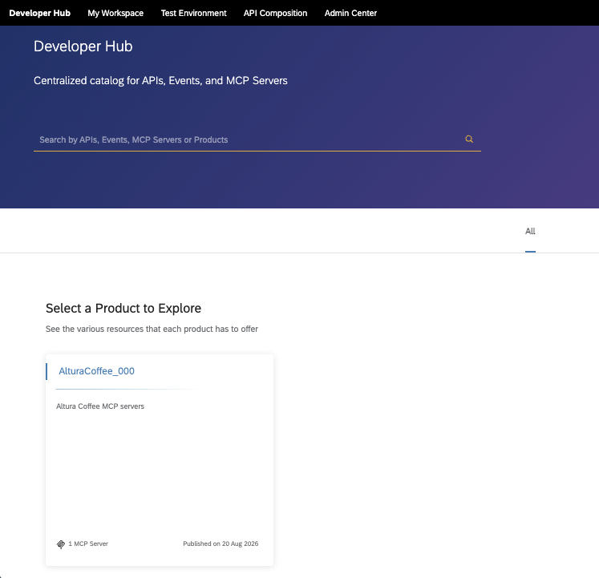

👉 Choose the product created (<dynamic>AlturaCoffee_${credentialsObj.alturawebsite.user}</dynamic>) and navigate to the ServiceLocator_${credentialsObj.alturawebsite.user} MCP server. Get familiar with the content available in the different tabs.

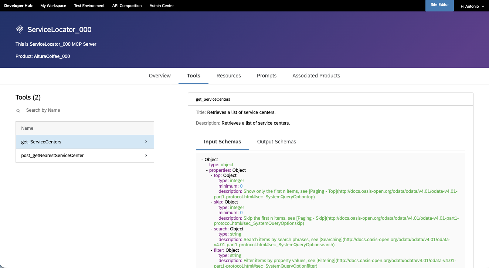

### Subscribe to the AlturaCoffee_${credentialsObj.alturawebsite.user} product

👉 In the Developer Hub, navigate to the <dynamic>**AlturaCoffee_${credentialsObj.alturawebsite.user}**</dynamic> product and choose **Subscribe**. In the pop-up dialog, select the application to subscribe to the product and choose **Subscribe** > **Create New Subscription for Agent**.

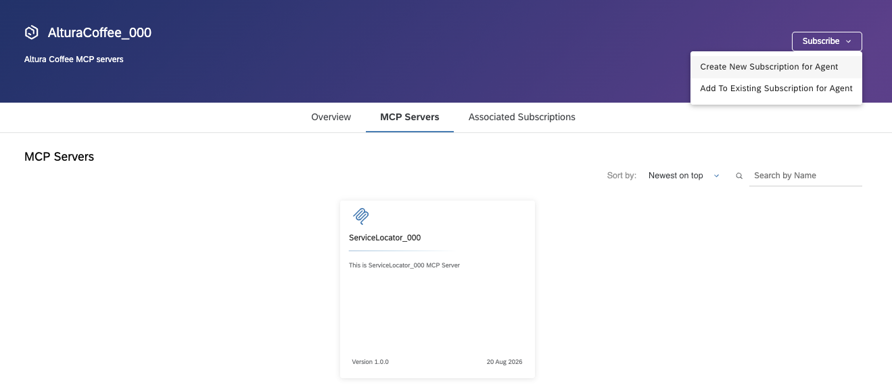

👉 Enter the details below in the pop-up dialog and choose **Create** when done. The subscription creation will take a minute or two to complete.

| Property | Value |
|----------|-------|
| Name | <dynamic>AI-integrations-agent-${credentialsObj.alturawebsite.user}</dynamic> |
| Short Text | <dynamic>AI-integrations user ${credentialsObj.alturawebsite.user} agent</dynamic> |

Once the subscription is ready, credentials will be available. We can check all our subscriptions in  **My Workspace**.

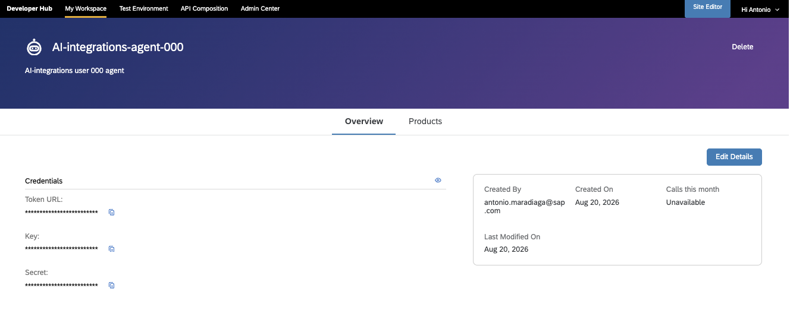

## Test the Service Locator MCP server

Instead of using MCP inspector as we did in the previous exercise, we will use Bruno this time around to get familiar with the MCP server.

> [!NOTE]
> Why using Bruno instead of MCP Inspector? Bruno is a tool that allows us to explore and test APIs. It is very likely that you are familiar with it. The communication with a remote MCP server is done via HTTP. Getting familiar with the HTTP requests and responses will help us understand how an LLM calls the MCP server. This can come in handy when experiencing issues when an LLM calls an MCP server, e.g. dealing with schema problems, authentication issues, etc.

👉 In Bruno, expand the **ai-enabled-integrations-codejam** collection and navigate to **mcp-servers** > **ServiceLocator** folder.

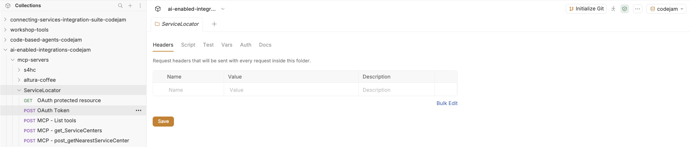

Lets explore the requests available:

- *GET OAuth protected resource*: According to the MCP specification, the MCP server exposes authentication details under the `/.well-known/oauth-protected-resource` endpoint. Here we will find the authentication server we can communicate with to get an access token to call the MCP server.
- *POST OAuth token*: This request allows us to get an access token from the authentication server. The access token is required to call the MCP server. This requests contains a script post response which will automatically set the `mcp_access_token` variable with the access token received from the authentication server.
- *POST MCP - List tools*: This request allows us to list all the tools available in the MCP server.
- *POST MCP - get_ServiceCenters*: Retrieves all the service centers available in the Service Locator service.
- *POST MCP - post_getNearestServiceCenter*: Find the nearest service centers for a given location. This request takes an address as input.

👉 Execute each one of the requests listed below. Get familiar with the request body (if one is specified) and the response of each request.

Once completed, you should be able to answer the following questions:

- How do I get an access token to call the MCP server?
- How can I list all the tools available in the MCP server?
- How can I call different tools? What would be different in my request payload?
- How does the list tool response look like? Is it different from the OpenAPI specification? Where in Integration Suite can I see this schema?
- What's the nearest service center for Hamburg, Germany?

> [!IMPORTANT]
> SAP Integration Suite provides monitoring capabilities for MCP servers. Similar to how you can monitor iFlows, you can also see the requests made to an MCP server. Navigate to **Monitor** > **Integration and APIs**. Select the **Integration Cell** runtime and **All Artifacts** in the *Monitor Message Processing* section.
> 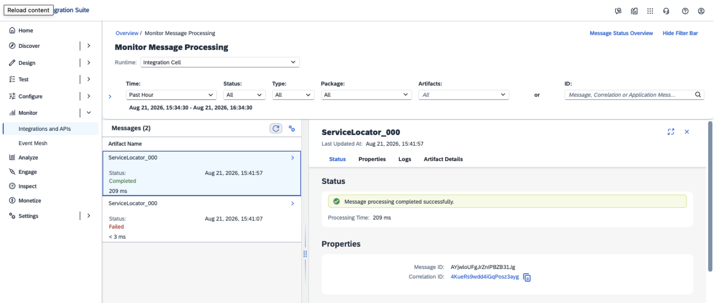

## Summary

We now have two MCP servers available. One straight from a CAP application and the one we added as part of this exercise in the MCP Gateway.

1. **Altura Customer Service system** - allows an LLM to list and retrieve customer service requests
2. **Service Centre Locator** - allows an LLM to list all service centers and find the nearest service centre for a given location.

We've learnt how to create an MCP server from an OpenAPI specification and expose it in the Developer Hub. In the next exercise, we will configure a code-based agent to use both of these MCP servers as tools, alongside a model deployed in SAP AI Core.

## Further Study

* [API-Centric Integration](https://help.sap.com/docs/integration-suite/isuite-integrations-and-apis/api-centric-integration?locale=en-US)
* [Create an MCP Server](https://help.sap.com/docs/integration-suite/isuite-integrations-and-apis/creating-mcp-server?locale=en-US)
* [Monitoring APIs and MCP servers](https://help.sap.com/docs/integration-suite/isuite-integrations-and-apis/monitor-apis?locale=en-US)

---

If you finish earlier than your fellow participants, you might like to ponder these questions. There isn't always a single correct answer and there are no prizes - they're just to give you something else to think about.

1. We provided a description for the MCP tool to help the LLM understand when to call it. How would you test whether your tool description is effective? What would you look for?
2. The Service Centre Locator API takes an address as input. The LLM response from our iFlow in Exercise 02 also contains postal codes and countries. Can you see how these two pieces could be combined in an automated workflow?
3. The MCP Gateway acts as an intermediary between the LLM client and the Service Centre Locator API. What additional policies (besides the MCP Gateway policy) might be useful to apply to this MCP server in a production scenario?

## Next

Continue to 👉 [Exercise 06 - Configure LLM client and MCP tools](exercises/06-configure-llm-client-mcp-tools/README.md)
