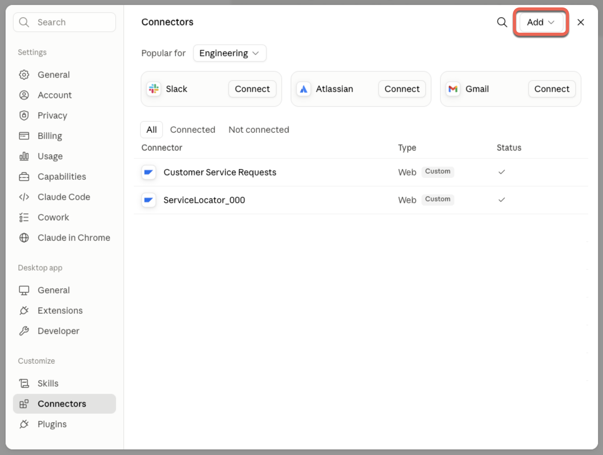
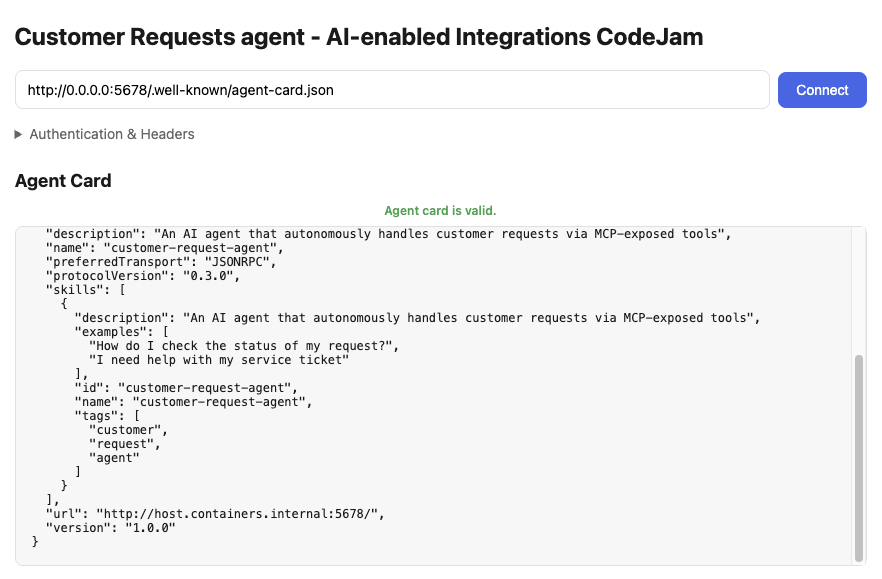
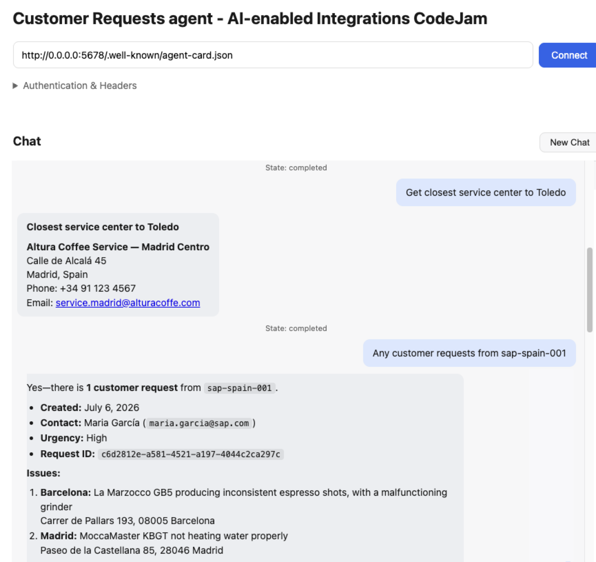

# Exercise 06 - Configure LLM client and MCP tools

We now have two MCP servers available, one from a CAP service and another one via the MCP Gateway. In this exercise we will configure a simple code-based agent. As an LLM we will use a model available in SAP AI Core and we will configure the MCP server as tools.

At the end of this exercise, you'll have a running agent connected to an LLM in SAP AI Core, with the Customer Service system and Service Centre Locator tools configured and available.

> [!IMPORTANT]
> These will not be a step by step instruction of how to build an agent. The goal of this exercise is to get familiar with how an LLM can be connected to MCP tools. If you are interested in learning more about Code-based agents, check out the [CodeJam - Build code-based AI Agents on SAP Business Technology Platform](https://github.com/SAP-samples/codejam-code-based-agents)

Now, we have an option. We can either use our own 🤖 LLM client , e.g. ChatGPT, Claude, or any other LLM client that supports the Model Context Protocol (MCP), or we can use a 🧑‍💻 simple code-based agent built with LangChain. The simplest might be configuring your own but the code-based agent will be more what we will need to create when deploying an MCP as part of an agent.

## 🤖 Configure your LLM client

Through exercises 4 and 5, we have interacted with two MCP servers. Below you can find links on how to configure MCP servers in different clients:

- ChatGPT: [Developer mode and MCP apps in ChatGPT](https://help.openai.com/en/articles/12584461-developer-mode-and-mcp-apps-in-chatgpt)
- Claude: [Get started with custom connectors using remote MCP](https://support.claude.com/en/articles/11175166-get-started-with-custom-connectors-using-remote-mcp)
   

## 🧑‍💻 Configure the code-based agent

The agent is a Python application built with [LangChain](https://python.langchain.com/) as the agent framework. LangChain provides the abstractions for connecting the LLM, tools, and conversation memory into a coherent agent loop. Under the hood it uses [LangGraph](https://langchain-ai.github.io/langgraph/) to manage the agentic state graph and [LiteLLM](https://docs.litellm.ai/) to route LLM calls to SAP AI Core.

> [!NOTE]
> The code for the agent is available in the `https://github.com/SAP-samples/ai-enabled-integrations-codejam/[PATH]/apps/customer-request-agent` folder of the repository. Understanding it is not required to complete this exercise, but you are welcome to explore it if you are interested in understanding how the agent is implemented. The new [Joule Studio](https://www.sap.com/products/artificial-intelligence/joule-studio.html) was used to build the agent and create the Agent UI.

The agent reads its configuration from a `.env` file located in the `app/` directory. Copy the `.env.example` and fill in the values:

```bash
cd /path/to/customer-request-agent/app
cp .env.example .env   # or edit .env directly if it already exists
```

The required variables are:

|Variable|Description|
|---|---|
|`LITELLM_PROVIDER`|Set to `sap` to use the SAP AI Core LiteLLM provider|
|`MODEL_NAME`|Set to a model available in SAP AI Core https://me.sap.com/notes/3437766|
|`AICORE_CLIENT_ID`|Service key `clientid` from your SAP AI Core instance|
|`AICORE_CLIENT_SECRET`|Service key `clientsecret` from your SAP AI Core instance|
|`AICORE_AUTH_URL`|OAuth token endpoint from your SAP AI Core service key|
|`AICORE_BASE_URL`|SAP AI Core API base URL|
|`AICORE_RESOURCE_GROUP`|Resource group where your LLM deployment lives|

> [!NOTE]
> The `IBD_TESTING` and `INVOKE_LIVE_MCP` variables control whether the agent calls real MCP servers or uses a local `mcp-mock.json` file. For this exercise leave both set to `1` so that the agent connects to the live MCP servers you configured in earlier exercises.

The agent connects to two MCP servers. Their URLs and credentials are also set via environment variables in the `.env` file:

|Variable|Description|
|---|---|
|`CUSTOMER_REQUEST_MCP_URL`|URL of the Customer Service MCP server (from Exercise 04)|
|`SERVICE_LOCATOR_MCP_SERVER_URL`|URL of the Service Locator MCP server exposed via MCP Gateway (from Exercise 05)|
|`SERVICE_LOCATOR_MCP_OAUTH_TOKEN_URL`|OAuth token endpoint for the Service Locator MCP server|
|`SERVICE_LOCATOR_MCP_OAUTH_CLIENT_ID`|OAuth client ID for the Service Locator MCP server|
|`SERVICE_LOCATOR_MCP_OAUTH_CLIENT_SECRET`|OAuth client secret for the Service Locator MCP server|

At startup, the agent calls each MCP server's tool listing endpoint and wraps every discovered tool as a LangChain `StructuredTool`. This means the LLM receives accurate, live tool schemas — no manual tool registration is needed. The Service Center Locator MCP server uses OAuth 2.0 client credentials and the agent fetches a token automatically before each call.

## Run the agent

Install dependencies and start the agent:

```bash
cd /path/to/customer-request-agent/app

# Create and activate a virtual environment (first time only)
python -m venv .venv
source .venv/bin/activate   # Windows: .venv\Scripts\activate

# Install dependencies (first time only)
pip install -r ../requirements.txt

# Start the agent
python main.py --port 5678
```

The agent exposes two endpoints:

- `http://localhost:5678/` — A2A JSON-RPC endpoint (agent protocol)
- `http://localhost:5678/ui` — built-in web UI for testing

👉 Open the [web UI in a browser](http://localhost:5678/ui) and start by connecting to the agent by choosing the **Connect** button. Once connected, it will display the Agent Card in the UI.



Now, our agent is ready. In the next exercises we will test the full end-to-end scenario



## Summary

The code-based agent is now running with:

- **LangChain** as the agent framework, orchestrating the LLM ↔ tool loop via LangGraph
- A connection to an LLM deployed in SAP AI Core, routed through LiteLLM
- Two live MCP tools: the Customer Service system (Exercise 04) and the Service Centre Locator via MCP Gateway (Exercise 05)

## Further Study

- [Models available in SAP AI Core](https://me.sap.com/notes/3437766)

---

If you finish earlier than your fellow participants, you might like to ponder these questions. There isn't always a single correct answer and there are no prizes - they're just to give you something else to think about.

1. How would you configure the MCP servers in an application like Claude or ChatGPT?
2. What are the differences between a code-based agent and a chat-based agent? What are the advantages and disadvantages of each approach?

## Next

Continue to 👉 [Exercise 07 - Test the scenario](exercises/07-test-scenario/README.md)
