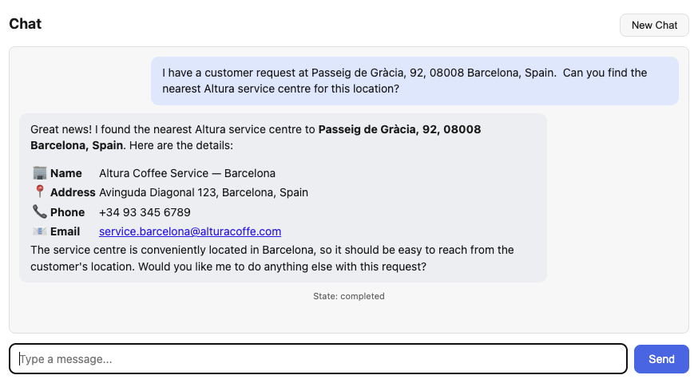

# Exercise 07 - Test the scenario

We have reached the final exercise of the CodeJam. Everything is now in place: we have an iFlow that processes customer support requests with unstructured data using an LLM, a customer service system that stores the results, two MCP servers exposing those capabilities as tools, and the Customer Requests agent configured to use them.

In this exercise, we will validate the complete integration scenario - from a request submitted via a website to a natural language prompt in the Customer Requests agent, through the MCP tools.

## The full scenario


Let's take a moment to recap all the moving parts of the scenario::

1. **Customer support request** - A customer submits a free-text support request via the Altura Coffee Co. website
2. **iFlow processing** - SAP Cloud Integration receives the request and sends it to an LLM in SAP AI Core, which extracts structured data (equipment, addresses, urgency). It then creates a new request in the customer service system.
3. **Customer service system** - The structured request is stored in the customer service system. This system exposes an MCP server that allows listing all requests and requests for a particular customer.
4. **Service Center Locator system** - This system exposes an API and we've created an MCP server in SAP Integration Suite, so an agent can interact with it.
5. **Agent** - The Customer Requests agent uses an LLM in AI Core and the MCP tools we created are familiar with.

## Test the integration scenario end-to-end

👉 Lets submit a new customer support request via the website (<${credentialsObj.alturawebsite.url}>) to verify the full scenario.

| Field | Value |
|-------|-------|
| Username | <dynamic>ai-integrations-${credentialsObj.alturawebsite.user}</dynamic> |
| Contact Name | ${userDetails.firstName} ${userDetails.lastName} |
| Contact Email | ${userDetails.email} |
| Country | Select your country, e.g. Spain |
| Request | Text below |


```text/plain
Hello Altura support team,

Our CafeLux Pro espresso machine at our main office on Passeig de Gràcia, 92, 08008 Barcelona
has stopped working completely - it won't turn on at all. 

We have an important client event tomorrow morning and urgently need this fixed.

Could you also check on the filter stock for the two WMF machines we have 
in the meeting rooms on the same floor?

Best regards,
${userDetails.firstName} ${userDetails.lastName}
Office Manager
```

👉 Check the customer service system (via the [web interface](${credentialsObj.alturacs.url}) or by calling the API via Bruno) to confirm the new request has been created.

## Test the MCP tools in the agent

Now let's interact with the MCP tools through the agent.

👉 Open the agent UI at [http://localhost:5678](http://localhost:5678) and start a new conversation.

### Scenario 1: Find the nearest service centre

👉 Type the following prompt:

```
I have a customer request at Passeig de Gràcia, 92, 08008 Barcelona, Spain. 
Can you find the nearest Altura service centre for this location?
```

The LLM should call the `find_nearest_service_centres` tool and return a list of nearby service centres with their contact details.



### Scenario 2: Look up recent customer requests

👉 In the same conversation (or a new one), type:

```
Can you show me the most recent customer service requests in the system? 
Focus on any that are marked as high urgency.
```

The LLM should call the `list_customer_requests` tool and filter or highlight the high-urgency entries.

### Scenario 3: Combined workflow

👉 Now test a combined workflow that requires both tools:

```
I need to handle the latest customer service request in the system. 
Can you look it up, identify the customer's address, find the nearest 
service centre, and give me a summary of what action I should take?
```

Watch as the LLM:

1. Calls `list_customer_requests` to get the latest request
2. Extracts the address from the request data
3. Calls `find_nearest_service_centres` with that address
4. Provides a summary combining both results

> [!TIP]
> 🧭 If the LLM doesn't automatically chain the tools together, you can guide it more explicitly: "First look up the latest request, then use that address to find the nearest service centre." More capable models handle multi-step tool use better than smaller models.

> [!NOTE]
> The quality of the LLM's response will vary depending on which model is configured in your SAP AI Core deployment. Larger, more capable models tend to be better at multi-step reasoning and chaining multiple tool calls.

## Explore further

Now that the basic scenario is working, try some variations of your own:

👉 Submit a customer support request in a different language (e.g. German or French) via the website and observe how the LLM handles the language in the prompt template.

👉 Try asking a question that cannot be answered by either tool (e.g. "What is the price of a La Marzocco Micra?") and observe how the LLM responds when no relevant tool is available.

## Summary

Congratulations - you have completed the AI-enabled Integrations CodeJam! 🎉

The scenario we built demonstrates how AI capabilities can be embedded throughout the integration lifecycle - from generating integration flows, to processing unstructured data with LLMs, to optimising scripts, and exposing APIs via the MCP Gateway as tools for AI assistants.

## Further Study

* [SAP Integration Suite - AI features](https://help.sap.com/docs/integration-suite/sap-integration-suite/artificial-intelligence?locale=en-US)
* [Model Context Protocol](https://modelcontextprotocol.io/)
* [Langchain](https://www.langchain.com/)
* [SAP AI Core](https://help.sap.com/docs/sap-ai-core?locale=en-US)
* [SAP Community - Integration page](https://community.sap.com/t5/integration/gh-p/integration)

---

If you finish earlier than your fellow participants, you might like to ponder these questions. There isn't always a single correct answer and there are no prizes - they're just to give you something else to think about.

1. Throughout the CodeJam, we used LLMs at three different points: to generate the iFlow, to process customer requests in the iFlow, and in our agent. Which of these three uses do you think adds the most value? Which carries the most risk?
2. The scenario currently requires a human (support agent) to interact with the LLM client to look up requests and find service centres. What would a fully automated version of this workflow look like? What would you need to add or change? When would you consider a fully automated workflow to be appropriate, and when would you want to keep a human in the loop?
   <details>
    <summary>⇟ Hint 🔦</summary>
    <i>Think about what triggers the automation (e.g. a new entry in the customer service system), how you would invoke the agent without human input, and how you would handle errors or ambiguous LLM responses in an unattended workflow.</i>
   </details>

## Next

You can take some time to explore the code of the different applications created to support this CodeJam. They are all available in the `https://github.com/SAP-samples/ai-enabled-integrations-codejam/tree/main/apps/` folder of the repository. Also, you can explore the [CodeJam - Build code-based AI Agents on SAP Business Technology Platform](https://github.com/SAP-samples/codejam-code-based-agents) if you want to learn more about code-based agents and how to build them..... or you can wait for Joule Studio to be generally available and let it do all the heavy lifting for you ;-).
