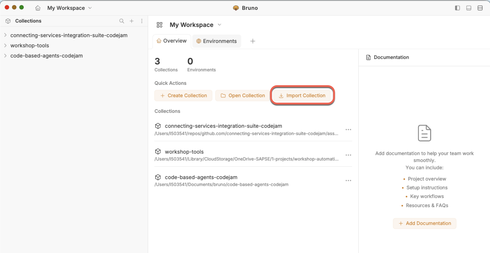

# Prerequisites

There are hardware, software, and service prerequisites for participating in this CodeJam. The exercises will be developed using SAP Integration Suite and SAP AI Core, which will be made available for the CodeJam.

## Accessing the supporting material referenced in exercises

In this CodeJam, you will see that across exercises, there are references to files that will help you get started or that are needed to complete the activities. To access these files, you can download the individual files directly from the repository website, or you can make a copy of the repository on your local machine by following one of the options below:

1. **(Recommended)** Clone the git repository in your local machine with the following command:

   ```bash
   git clone https://github.com/SAP-samples/ai-enabled-integrations-codejam.git
   ```

   > If you've set up [SSH to communicate with GitHub](https://docs.github.com/en/authentication/connecting-to-github-with-ssh) from your local machine, you can clone it using the following command: `git clone git@github.com:SAP-samples/ai-enabled-integrations-codejam.git`

   Using `git` is recommended as there might be future updates on the CodeJam content; updating your local copy will just be a command away.

   ```bash
   git pull origin main
   ```

2. Alternatively, download the [repository as a zip](https://github.com/SAP-samples/ai-enabled-integrations-codejam/archive/refs/heads/main.zip), and unzip it.

## Hardware

None.

## Software

### Web browser

A web browser supported by SAP Integration Suite[^1]: For the UIs of the service, the following browsers are supported on Microsoft Windows PCs and, where mentioned below, on macOS. Note that, however, certain limitations might apply for specific browsers:

```text
SAP Integration Suite has been tested using the following browsers:
- Google Chrome (latest version)
- Microsoft Edge (latest version)
- Mozilla Firefox (latest version)
```

### Bruno (REST client)

Some exercises require calling REST APIs. As part of the CodeJam we will use [Bruno](https://www.usebruno.com/) - a Git-friendly open source API client.

After installing Bruno, you can import the collection that will be used in the exercises. The collection (`ai-enabled-integrations-codejam.yml`) is available in the `assets/bruno` folder of the repository.



> [!IMPORTANT]
> During the CodeJam, the instructor will provide you with the necessary credentials to configure in the Bruno environment.

## Services

### SAP Integration Suite

Access to an SAP Integration Suite tenant is required. As part of this CodeJam, your instructor will provide the necessary credentials to access a shared tenant. The tenant will have the following capabilities enabled:

- **Cloud Integration** - for building and running integration flows
- **API Management** - for managing APIs and configuring the MCP server

If you are completing this CodeJam on your own, you can use an [SAP BTP Trial account](https://www.sap.com/products/technology-platform/trial.html) and set up SAP Integration Suite there. You will not be able to complete exercises 1 to 3 but it is possible to complete the exercises that explore the MCP capabilities.

### SAP AI Core

SAP AI Core provides the LLM capabilities used in this CodeJam. An instance of SAP AI Core will be pre-configured in the shared SAP Integration Suite tenant. It will have the following already set up:

- A deployed model (e.g. `gpt-4o-mini` or equivalent)
- A prompt template for processing customer support requests

If running on your own, refer to the [SAP AI Core documentation](https://help.sap.com/docs/sap-ai-core) for setup instructions.

### MCP Inspector

The MCP Inspector is a developer tool that allows exploring and testing MCP servers. It is available in the browser, on the command line, and in the terminal. As part of this CodeJam we will use the MCP Inspector to explore the MCP servers that is available and the one we will create in the next exercise.

👉 Install the MCP inspector in your local environment. Follow the instructions available here: <https://modelcontextprotocol.io/docs/2026-07-28/tools/inspector>

The easiest way to run MCP Inspector is via `npx`. `npx` (Node Package eXecute) is a command-line tool bundled with npm that allows you to execute Node.js packages without installing them globally or permanently in a project:

```bash
$ npx @modelcontextprotocol/inspector

# --- 
# It will automatically open in a browser
# ---

Starting MCP inspector...

MCP Inspector Web is up and running at:
   http://localhost:6274?MCP_INSPECTOR_API_TOKEN=22496....

   Sandbox (MCP Apps): http://localhost:65125/sandbox

   Auth token: 22496....

Opening browser...
```

## Checklist

Use the checklist below to verify that you have everything ready before the CodeJam:

- [ ] Access to a web browser (Chrome, Edge, or Firefox - latest version)
- [ ] Installed Bruno and imported the collection
- [ ] SAP Integration Suite credentials received from instructor 🔐
- [ ] SAP AI Core proxy URL and credentials received from instructor 🔐
- [ ] MCP Inspector running locally

[^1]: [Browser support for SAP Integration Suite](https://help.sap.com/docs/integration-suite/sap-integration-suite/browser-support)
